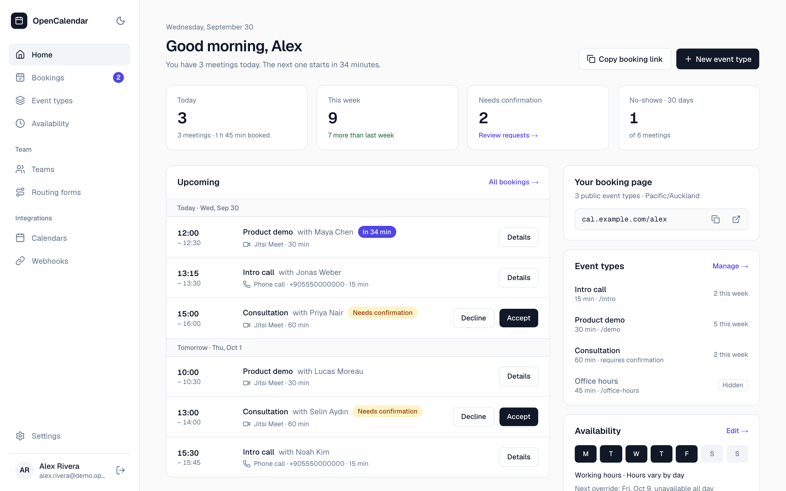
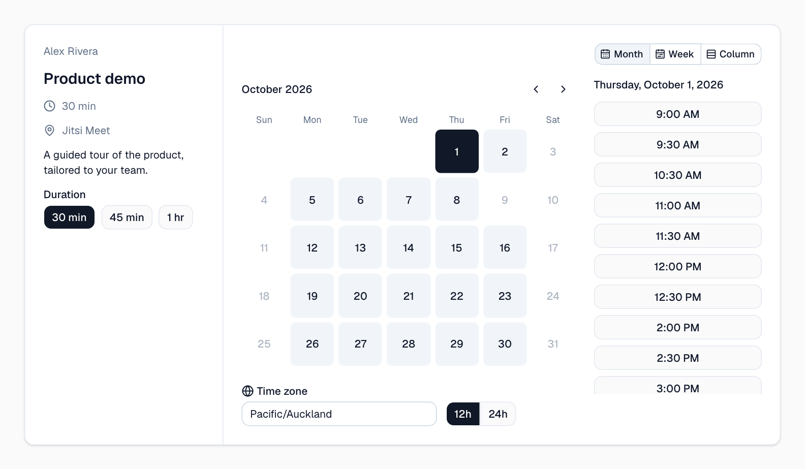
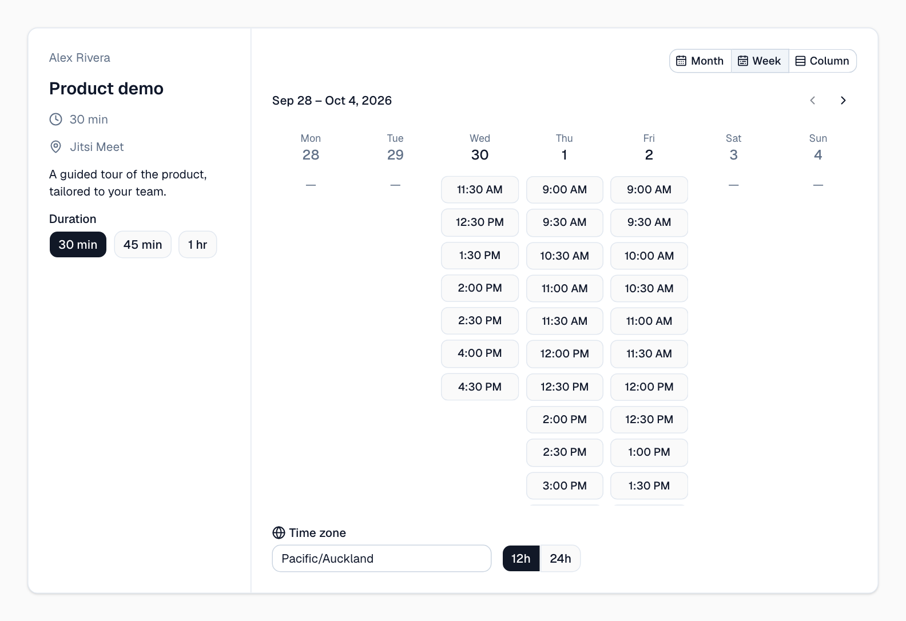
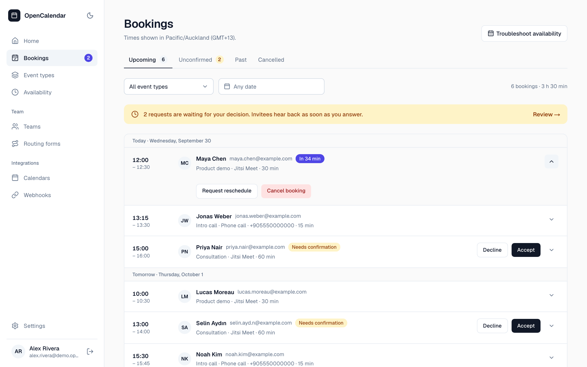
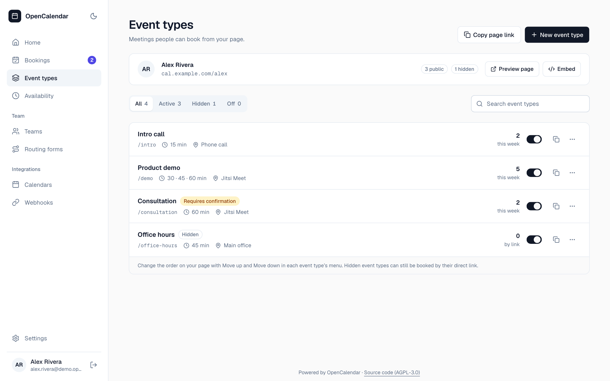
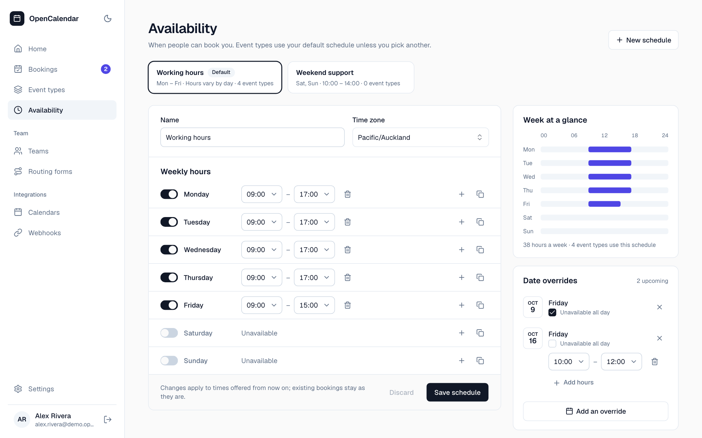
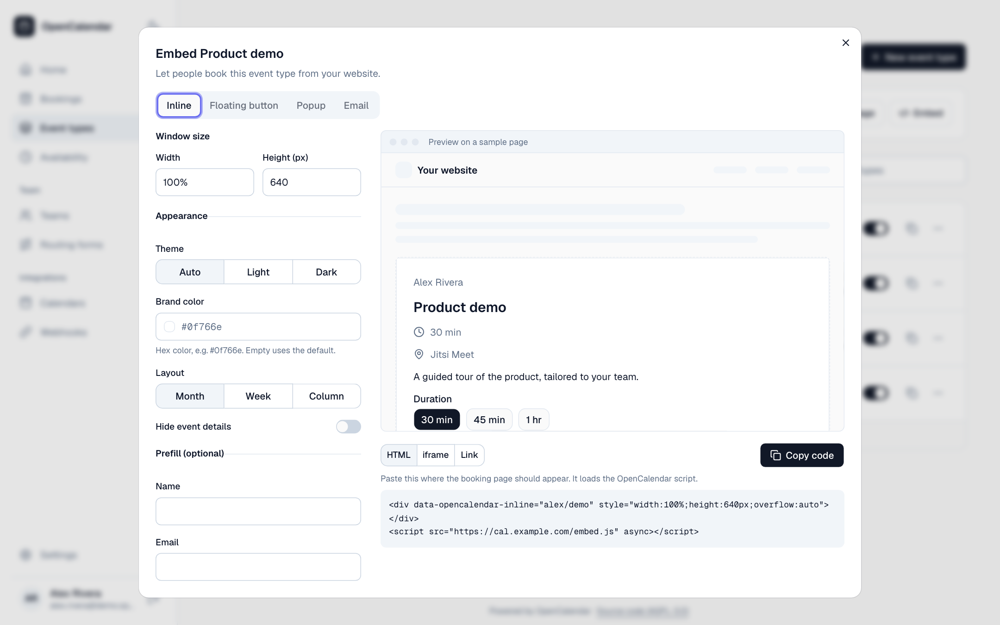
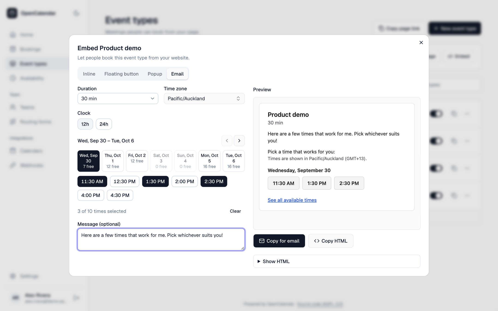
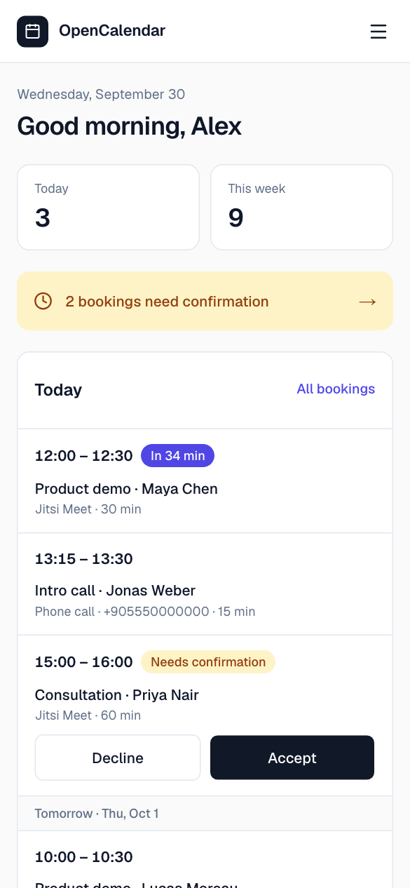
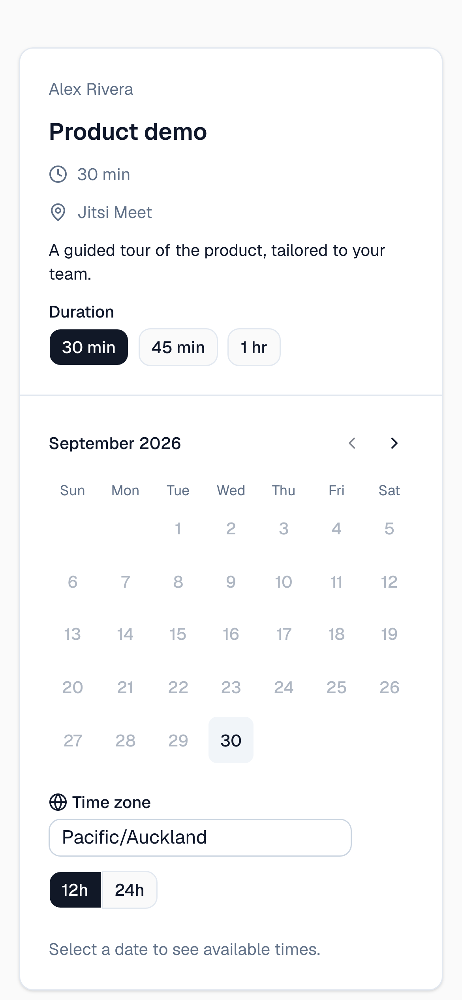

<div align="center">

# OpenCalendar

**Open-source scheduling you can host yourself.**<br>
Booking pages, availability, calendar sync, team scheduling and embeds, all in the open core.
No license keys, no telemetry.

[](https://github.com/kudretyilmazz/opencalendar/actions/workflows/ci.yml)
[](https://github.com/kudretyilmazz/opencalendar/releases)
[](./LICENSE)
[](https://github.com/kudretyilmazz/opencalendar/pkgs/container/opencalendar)

[Quick start](#quick-start-self-hosting) · [Features](#features) · [User guide](./docs/06-user-guide/README.md) · [Self-hosting](./docs/03-architecture/self-hosting.md) · [Changelog](./CHANGELOG.md)

<br>

<picture>
  <source media="(prefers-color-scheme: dark)" srcset="docs/images/dashboard-dark.png">
  
</picture>

</div>

## Why OpenCalendar

An alternative to Cal.com and Calendly that you run on your own server.

- **Everything is in the open core.** Round robin, collective and managed event types, routing forms, workflows and webhooks are included. Nothing sits behind a paywall.
- **Self-host first.** One Docker image plus PostgreSQL, with no Redis. Configuration is at runtime, migrations run automatically, and health endpoints and Prometheus metrics are built in.
- **Your data stays yours.** AGPL-3.0, no license keys and no telemetry. Calendar credentials are encrypted at rest.
- **Accessible.** Built to WCAG 2.2 AA and checked with axe in the end-to-end suite, with light and dark themes and layouts that work down to phone width.

## A booking page people enjoy

Invitees see times in their own time zone, choose a duration and book in a few clicks. They can switch between **month**, **week** and **column** layouts.

<table>
  <tr>
    <td width="50%"></td>
    <td width="50%"></td>
  </tr>
  <tr>
    <td align="center"><sub>Month layout: pick a day, then a time</sub></td>
    <td align="center"><sub>Week layout: the whole week at a glance</sub></td>
  </tr>
</table>

## Run your day from one place

<table>
  <tr>
    <td width="50%"></td>
    <td width="50%"></td>
  </tr>
  <tr>
    <td align="center"><sub><b>Bookings</b>: accept requests, reschedule, cancel, mark no-shows</sub></td>
    <td align="center"><sub><b>Event types</b>: durations, locations, questions, limits, private links</sub></td>
  </tr>
</table>


<p align="center"><sub><b>Availability</b>: weekly hours, date overrides, several schedules, and a troubleshooter that explains why a time is or isn't offered</sub></p>

## Embed it anywhere, even in an email

Open **Embed** on any event type, your profile, a team or a routing form. Pick inline, a floating button or a popup, adjust the theme, brand color and layout, and watch a live preview before you copy the code.

<table>
  <tr>
    <td width="50%"></td>
    <td width="50%"></td>
  </tr>
  <tr>
    <td align="center"><sub><b>Embed builder</b>: inline, floating button, popup, iframe or plain link</sub></td>
    <td align="center"><sub><b>Email embed</b>: paste free times into Gmail or Outlook; each one opens the booking form on that time</sub></td>
  </tr>
</table>

```html
<div data-opencalendar-inline="alex/demo"></div>
<script src="https://cal.example.com/embed.js" async></script>
```

## On your phone, too

<table>
  <tr>
    <td align="center" width="50%"></td>
    <td align="center" width="50%"></td>
  </tr>
</table>

## Features

- **Booking pages.**
  - Time-zone detection, several durations and month, week or column layouts.
  - Locations: in person, phone, link, Jitsi, Google Meet, Microsoft Teams and Zoom.
  - Booking questions with URL prefill, seats and recurring bookings.
  - Requires-confirmation, limits, single-use links and cancellation policies.
- **Availability.**
  - Weekly hours and date overrides.
  - Connected calendars: Google, Microsoft 365, CalDAV (such as iCloud, Fastmail or Nextcloud) and ICS feeds.
  - A troubleshooter that explains *why* a time is or isn't bookable.
- **Teams.**
  - Collective and round-robin event types, with weights, priority and fixed hosts.
  - Managed event types with locked fields.
  - Dynamic group links, a team availability view and routing forms.
- **Automation.** Email notifications with calendar invites, reminder workflows, and signed webhooks with retries and a delivery log.
- **Embeds.**
  - An embed builder with a live preview: inline, popup, floating button, iframe and link.
  - An email embed with time links.
  - Versioned `postMessage` events and auto-resize.
- **Self-host first.**
  - One Docker image plus PostgreSQL (no Redis), with runtime configuration.
  - Automatic migrations, health endpoints and Prometheus metrics.
  - AGPL-3.0, no license keys, no telemetry.

## Quick start (self-hosting)

```bash
git clone https://github.com/kudretyilmazz/opencalendar.git && cd opencalendar
cp .env.example .env   # set APP_URL, AUTH_SECRET, ENCRYPTION_KEY, POSTGRES_PASSWORD and SMTP
OPENCALENDAR_IMAGE=ghcr.io/kudretyilmazz/opencalendar:1 docker compose up -d --no-build
```

The app listens on `127.0.0.1:3000`. Put a TLS reverse proxy (e.g. Caddy) in front and create your account right away: the first account becomes the administrator. Full guide: [self-hosting](./docs/03-architecture/self-hosting.md).

## Documentation

- [User guide](./docs/06-user-guide/README.md): using OpenCalendar
- [Self-hosting](./docs/03-architecture/self-hosting.md): install, configure, upgrade, back up
- [Webhooks](./docs/03-architecture/api-and-webhooks.md#webhooks) and [embeds](./docs/03-architecture/embeds.md): reference
- [Security](./docs/03-architecture/security.md) · [Changelog](./CHANGELOG.md) · [Roadmap](./docs/05-roadmap/roadmap.md)
- Everything else (research, requirements, architecture, ADRs): [`docs/`](./docs/README.md)

## Development

```bash
npm install
npm run services:up   # PostgreSQL, Mailpit and a CalDAV server in Docker
cp .env.example .env  # then set AUTH_SECRET and ENCRYPTION_KEY
npm run db:migrate
npm run dev
```

- **Tests:** `npm test` runs the unit and integration suites (needs Docker for Testcontainers). `npm run test:e2e` runs Playwright.
- **README screenshots:** `npm run screenshots` fills a demo account with sample data and rewrites `docs/images/`.
- **More:** [setup](./docs/04-development/setup.md), [testing](./docs/04-development/testing.md) and [CONTRIBUTING.md](./CONTRIBUTING.md).

Tech stack: Next.js 16 (App Router) · React 19 · TypeScript · PostgreSQL 16 + Drizzle · Better Auth · pg-boss · Tailwind CSS 4 + shadcn/ui · Vitest + Playwright.

## Security

Please report vulnerabilities privately; see [SECURITY.md](./SECURITY.md).

## License

[GNU Affero General Public License v3.0](./LICENSE). If you run a modified version as a service, you must offer its source to your users. Set `SOURCE_URL` to your fork; every page footer links to it.
