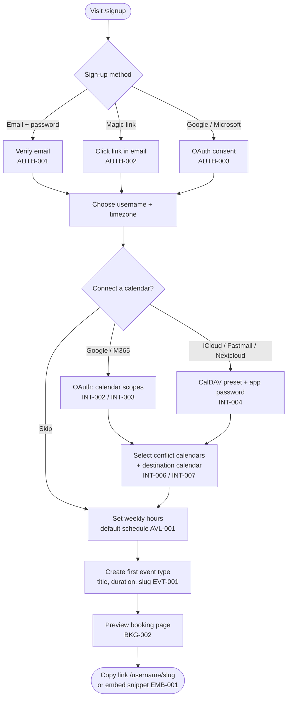
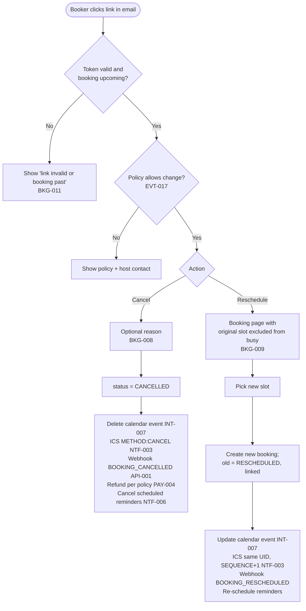
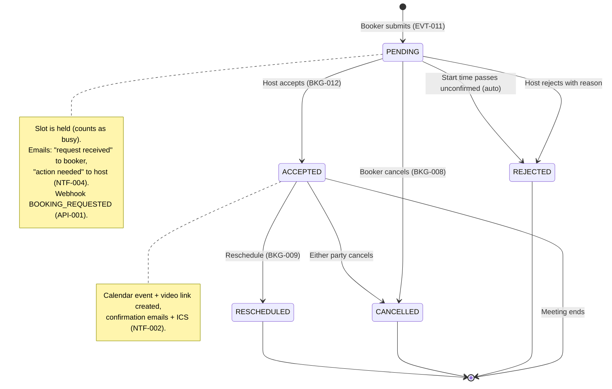
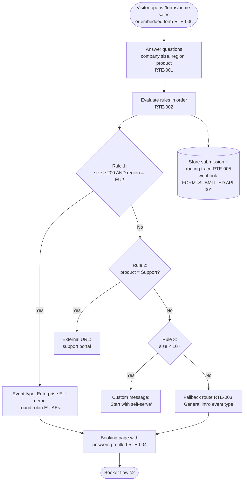
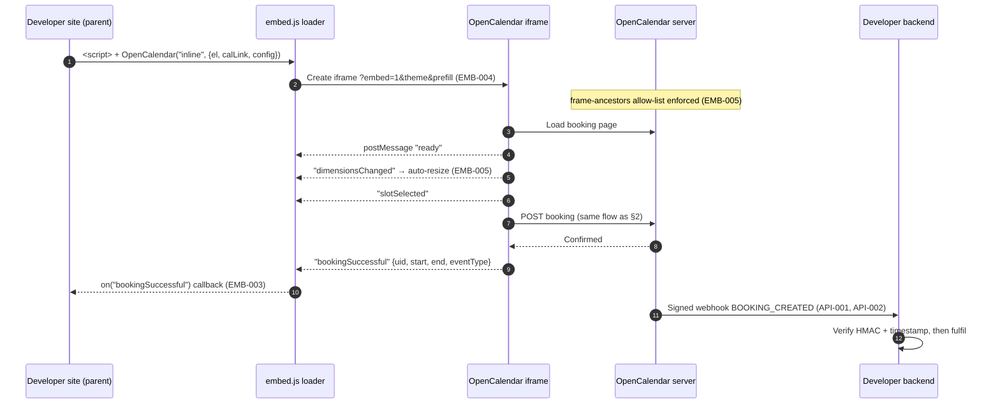
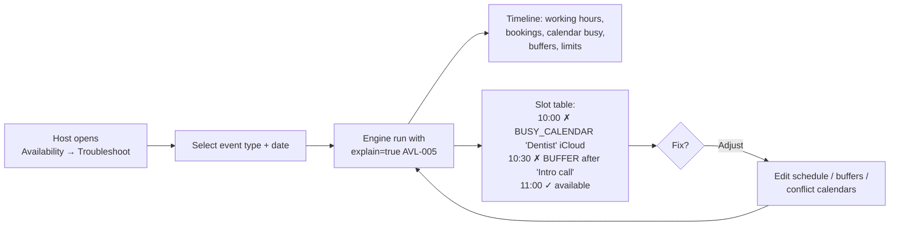

# User Flows

These diagrams show the main host, booker, team and developer journeys in OpenCalendar and link each step to its requirement IDs.

Last updated: 2026-09-28

Related: [Requirements](./requirements.md) · [Glossary](./glossary.md) · [Availability engine](../03-architecture/availability-engine.md) · [Data model](../03-architecture/data-model.md)

---

Requirement IDs such as `BKG-005` refer to [requirements.md](./requirements.md). Terms such as *slot*, *hold* and *destination calendar* are defined in the [glossary](./glossary.md).

## 1. Host onboarding

The goal is that a new host shares a working booking link within 10 minutes. The onboarding wizard can be skipped at any step and resumed from the dashboard.

1. **Sign up.** The host uses email and password, a magic link, or Google/Microsoft (AUTH-001–003).
2. **Set profile details.** The wizard asks for a username and timezone. The timezone is prefilled from the browser.
3. **Connect a calendar.** This step is optional until M2 ships. Choices are Google, Microsoft 365 or CalDAV (INT-002–004). The wizard preselects conflict calendars and a destination calendar (INT-006, INT-007).
4. **Set a schedule.** The host adjusts the default working hours (AVL-001).
5. **Create an event type.** The host starts from a template such as "30 min meeting" (EVT-001).
6. **Share the link.** The host copies the link or embed code.



## 2. Booker flow

The booker doesn't need an account. Slots are always computed server-side by the availability engine (AVL-003). The client never decides whether a slot is available.

1. **Discover.** The booker opens `/{username}` (BKG-001) or goes straight to an event type.
2. **Pick a date and slot.** Timezone and 12h/24h format are detected automatically and can be changed (BKG-003, I18N-001).
3. **Fill in the form.** Selecting a slot places a short hold on it (BKG-006). The form includes any custom questions (EVT-009).
4. **Pay, if required.** Paid event types create an `AWAITING_PAYMENT` booking and hold the slot until payment is confirmed (PAY-003).
5. **Confirm.** The server re-validates the slot inside a transaction, backed by the exclusion constraint (BKG-005, NFR-004).
6. **Side effects run as queued jobs.** These are emails with ICS (NTF-002), the destination calendar event and conferencing link (INT-007, INT-008), webhooks (API-001) and reminders (NTF-006).

```mermaid
sequenceDiagram
    autonumber
    actor B as Booker
    participant UI as Booking page
    participant API as OpenCalendar server
    participant ENG as Availability engine
    participant DB as PostgreSQL
    participant PAY as Stripe
    participant Q as Job queue (pg-boss)
    participant CAL as Host calendar / video

    B->>UI: Open /{username}/{slug}
    UI->>API: GET slots(month, tz)
    API->>ENG: schedule + overrides + bookings + cached busy
    ENG-->>API: slots (+ reason codes)
    API-->>UI: available dates & slots (BKG-002)
    B->>UI: Pick date, slot, tz, 12/24h (BKG-003)
    UI->>API: Create hold (BKG-006)
    B->>UI: Submit form: name, email, answers (BKG-004, EVT-009)
    UI->>API: POST booking
    API->>DB: BEGIN; re-check slot; INSERT booking (exclusion constraint)
    alt Slot taken meanwhile
        DB-->>API: constraint violation
        API-->>UI: 409 "Slot no longer available", refresh slots
    else Paid event type
        DB-->>API: booking AWAITING_PAYMENT
        API-->>UI: Redirect to Stripe Checkout (PAY-002)
        B->>PAY: Pay
        PAY->>API: Signed webhook payment_succeeded
        API->>DB: status = ACCEPTED (PAY-003)
    else Free event type
        DB-->>API: booking ACCEPTED; COMMIT
    end
    API-->>UI: Confirmation page (BKG-007) or redirect (EVT-016)
    API->>Q: enqueue side effects
    Q->>CAL: Create event + conferencing link (INT-007, INT-008)
    Q->>B: Confirmation email + ICS + cancel/reschedule links (NTF-002)
    Q->>API: Host email, webhooks BOOKING_CREATED (API-001), schedule reminders (NTF-006)
```

## 3. Reschedule and cancel via link

Manage links carry an unguessable, booking-scoped token (BKG-011), so the booker doesn't need to log in. For rescheduling, the original booking doesn't count as busy while the booker picks a new time (BKG-009). The ICS update reuses the same `UID` with an incremented `SEQUENCE`, so calendar clients update the existing event instead of adding a duplicate (NTF-003). If the host has set a cancellation cutoff or disabled self-service changes, the links show the policy instead of the action (EVT-017).



The host can also cancel or request a reschedule from the dashboard (BKG-010). A reschedule request cancels the booking and emails the booker a link to book again.

## 4. Requires-confirmation flow

When an event type requires confirmation (EVT-011), the slot is still blocked while the booking is `PENDING`, so nobody else can take it. The host accepts or rejects from the dashboard's Unconfirmed tab or through signed one-click links in the email (BKG-012). The emails are covered by NTF-004.



## 5. Team round-robin booking

For a round-robin event type (TEAM-005), the booker sees the union of slots across all hosts in the pool. Fixed hosts (TEAM-007) must also be free, so their availability is intersected with the pool. The host is chosen only at booking time, among the hosts who are free for that exact slot, in this order:

1. Weighted fairness (TEAM-006)
2. Fewest bookings in the window
3. Priority as the tiebreaker

The chosen host and the reason are stored on the booking so admins can answer "why did Alice get this?". Slot queries for 10 hosts must meet NFR-002.

```mermaid
sequenceDiagram
    autonumber
    actor B as Booker
    participant API as Server
    participant ENG as Availability engine
    participant RR as Host selector
    participant DB as PostgreSQL

    B->>API: GET slots for /team/acme/intro
    API->>ENG: For each host: working hours − busy (cached calendars)
    ENG-->>API: Per-host free ranges
    API->>API: slots = (∩ fixed hosts) ∩ (∪ RR pool) (TEAM-005, TEAM-007)
    API-->>B: Slots
    B->>API: POST booking(slot)
    API->>ENG: Which RR hosts are free at slot?
    ENG-->>API: [alice, bob, chen]
    API->>RR: Select(host candidates, weights, priority, recent counts)
    RR-->>API: bob — reason: "lowest weighted load (3/5 vs 4/5), priority tie"
    API->>DB: BEGIN; INSERT booking(host=bob, rr_reason) with exclusion constraint
    alt bob just got booked elsewhere
        DB-->>API: conflict
        API->>RR: Re-select excluding bob
    end
    DB-->>API: COMMIT
    API-->>B: Confirmation (host: Bob)
```

Collective event types (TEAM-004) work the same way, except that slots are the intersection across all hosts and the booking includes every host.

## 6. Routing form to event type

A routing form (RTE-001) qualifies the booker before they reach the right booking page. Rules are evaluated in order and the first match wins (RTE-002). If nothing matches, the mandatory fallback applies (RTE-003). Answers prefill booking questions (RTE-004), and each submission is stored with a trace (RTE-005).



## 7. Embed flow

A developer pastes a snippet (EMB-001/002). The host page loads a small loader script, which creates an iframe pointing at the booking page with embed-mode parameters. Communication goes through versioned `postMessage` events with origin checks (EMB-003). For server-side trust, the developer should rely on the signed webhook (API-002) and not on client-side events.



The popup and floating-button modes (EMB-002) use the same iframe inside a modal that the loader creates.

## 8. Availability explainability (supporting flow)

When a host asks "why can't people book me on Tuesday at 10:00?", they open the debug view (AVL-008). They choose an event type and a date. The server runs the same engine used for booking, with reason codes enabled (AVL-005), and the view lists every candidate slot with its status and reasons.


