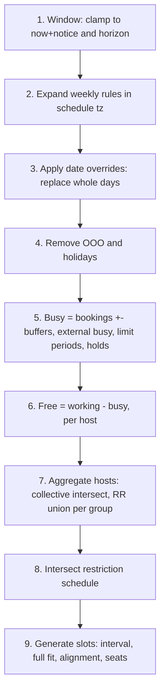

# Availability engine

Design of `lib/availability`: a pure, explainable interval-algebra engine that turns schedules, bookings and busy times into bookable slots.

Last updated: 2026-09-28

The engine is the heart of the product and the source of most scheduling bugs in other tools
("my availability disappeared", see [../01-research/calcom.md](../01-research/calcom.md) pain
point 7). It is therefore **pure**: no database, no network, no `Date.now()`, no `process.env`.
The slot service (`features/slots/server`) loads data and passes it in; the engine returns data.
Where it sits in the system: [system-overview.md](./system-overview.md). Tables it reads:
[data-model.md](./data-model.md).

## Core types

All instants are **UTC epoch milliseconds** (`number`). Intervals are half-open `[start, end)`.

```ts
type Ms = number;                         // UTC epoch milliseconds
interface Interval { start: Ms; end: Ms } // half-open, start < end
type IntervalSet = readonly Interval[];   // normalized: sorted, non-overlapping, non-adjacent
interface DateRange { start: Ms; end: Ms } // query window

type RemovalReason =
  | 'outside_working_hours' | 'date_override' | 'ooo' | 'booking_conflict'
  | 'external_calendar_busy' | 'buffer' | 'min_notice' | 'beyond_horizon'
  | 'limit_reached' | 'slot_held' | 'seats_full' | 'restriction_schedule'
  | 'no_common_availability';

interface TaggedInterval extends Interval { reason: RemovalReason; ref?: string } // ref: booking uid, calendar id...

interface WeeklyRule { weekday: 0|1|2|3|4|5|6; start: string /* HH:mm */; end: string /* HH:mm, '00:00' = 24:00 */ }
interface DateOverride { date: string /* YYYY-MM-DD in schedule tz */; ranges: { start: string; end: string }[] } // [] = day off
interface ScheduleInput { timeZone: string; rules: WeeklyRule[]; overrides: DateOverride[] }

interface HostInput {
  userId: string;
  isFixed: boolean;            // collective hosts and RR fixed hosts
  groupKey?: string;           // RR host group
  schedule: ScheduleInput;
  ooo: Interval[];
  bookings: { uid: string; start: Ms; end: Ms; bufferBefore: number; bufferAfter: number; seated?: { taken: number; capacity: number } }[];
  externalBusy: { calendarId: string; start: Ms; end: Ms }[];
  limitBlocked: TaggedInterval[];  // precomputed periods where a limit is reached
  holds: Interval[];               // slot_reservation rows of other sessions
}

interface EventTypeInput {
  durationMin: number; slotIntervalMin?: number;
  bufferBeforeMin: number; bufferAfterMin: number;
  minNoticeMin: number;
  horizon: { type: 'rolling_days' | 'rolling_business_days'; days: number } | { type: 'date_range'; start: string; end: string } | { type: 'unlimited' };
  seatsPerSlot?: number;
  schedulingType: 'personal' | 'collective' | 'round_robin' | 'managed';
  restriction?: ScheduleInput;
}

interface SlotQuery {
  now: Ms; window: DateRange; bookerTimeZone: string;
  rescheduleUid?: string;       // booking being moved is ignored as busy
  explain?: boolean;            // owner-only diagnostics
}

interface Slot { start: Ms; end: Ms; seatsRemaining?: number; hostIds: string[] }
interface SlotResult { slots: Slot[]; removed?: TaggedInterval[] /* when explain */ }
```

## Interval operations (`lib/availability/intervals.ts`)

All operations take and return **normalized** sets and are O(n + m) merges over sorted arrays.

```ts
function normalize(xs: Iterable<Interval>): IntervalSet;         // sort, drop empty, merge overlap/adjacent
function union(a: IntervalSet, b: IntervalSet): IntervalSet;
function intersect(a: IntervalSet, b: IntervalSet): IntervalSet;
function subtract(a: IntervalSet, b: IntervalSet): IntervalSet;  // a minus b
function clamp(a: IntervalSet, w: DateRange): IntervalSet;
function subtractTagged(a: IntervalSet, b: TaggedInterval[], out: TaggedInterval[]): IntervalSet; // records what was removed
```

Laws covered by property-based tests (fast-check): `union` is commutative/associative,
`subtract(a, a) = []`, `intersect(a, union(a, b)) = a`, results always normalized, zero-length
input intervals are dropped.

## Pipeline



1. **Window.** `effectiveStart = max(window.start, now + minNotice)`;
   `effectiveEnd = min(window.end, horizonEnd)`. Horizon is computed in the **owner's schedule
   tz** (rolling N days = end of local day N; business days skip Sat/Sun, holidays later).
   Anything cut is tagged `min_notice` or `beyond_horizon`.
2. **Expand weekly rules.** For each local calendar date `d` in the window (plus one day of
   padding on each side for tz offsets), for each rule with `weekday(d)`, build wall-clock
   `d start` and `d end` in the schedule tz with `TZDate` from `@date-fns/tz` and convert to UTC.
   - `end = '00:00'` means midnight of `d + 1`.
   - **DST gap** (e.g. 02:30 on spring-forward day in America/New_York does not exist): a wall
     time in the gap is shifted forward by the gap length (02:30 → 03:30 EDT), the same as
     Temporal's `"compatible"` disambiguation. A rule 09:00-17:00 is unaffected; a rule
     00:00-24:00 is 23 h long that day. *(M1 implementation; the draft said "first valid
     instant", which is less standard.)*
   - **DST overlap** (fall-back 01:00-02:00 occurs twice): start uses the earlier offset, end
     uses the later one, so the range covers the full wall-clock span (25 h days are allowed).
   - Europe/Istanbul has had fixed UTC+3 with no DST since 2016; tests assert no special casing
     leaks into zones without transitions.
3. **Overrides.** For every date with overrides, remove that local day's rule intervals
   entirely and add the override ranges (empty = day off). Removed time is tagged
   `date_override`. Overrides are per local date of the schedule tz, not UTC date.
4. **OOO and holidays.** Subtract `ooo` (tag `ooo`). Holidays arrive as OOO-like intervals.
5. **Busy set** per host (all tagged):
   - each booking `[start - bufferBefore, end + bufferAfter]` using the **existing booking's**
     buffers, plus the **new event's** buffers applied around candidate slots in step 9
     (tag `booking_conflict`, buffer-only parts `buffer`);
   - skip the booking whose uid is `rescheduleUid`;
   - seated bookings with seats left are busy only for their buffers when the candidate is the
     same event type and same start (so remaining seats stay bookable);
   - `externalBusy` (tag `external_calendar_busy`), excluding the external event that mirrors a
     booking already in `bookings` (matched by `booking_reference`);
   - `limitBlocked` (tag `limit_reached`): computed by the service from counts/durations per
     day/week/month/year in the owner tz; the engine only subtracts them;
   - `holds` (tag `slot_held`).
6. **Free** = working minus busy (per host).
7. **Aggregate hosts.**
   - `personal`: the single host.
   - `collective`: `intersect` of all hosts' free sets.
   - `round_robin`: fixed hosts intersected; non-fixed hosts are `union`ed within each
     `groupKey`; each group intersected with the others and with the fixed set. Each resulting
     free interval remembers which hosts cover it (for `hostIds`).
   - Time lost here with every host individually free somewhere is tagged `no_common_availability`.
8. **Restriction schedule** (M3): intersect with the event type's restriction schedule
   expanded like step 2 (tag `restriction_schedule`).
9. **Slots.** Step `slotInterval ?? duration` starting from aligned boundaries: a candidate
   start is aligned to the step **measured from local midnight in the owner schedule tz**
   (so 30-min slots start at :00/:30 local even when the free range starts at 09:10, giving
   09:30). A candidate `[s, s + duration)` is valid only if the whole interval plus the new
   event's buffers `[s - bufferBefore, s + duration + bufferAfter)` fits inside free time (buffers
   may overlap non-working time but not busy time). Seated events report
   `seatsRemaining = capacity - taken`; `0` removes the slot (tag `seats_full`). Output is
   sorted, de-duplicated and grouped by date in the **booker tz** by the caller.

## M1 implementation notes

- Implemented in `lib/availability/` with no dependencies: time-zone math uses `Intl`
  (`tz.ts`), so the same code runs in the browser for the booking widget.
- M1 computes slots for a single host (`computeSlots(event, host, query)`); multi-host
  aggregation (steps 7) arrives with teams in M4, restriction schedules and limits in M3.
- Reason codes in M1: `min_notice`, `beyond_horizon`, `outside_working_hours`, `date_override`,
  `ooo`, `booking_conflict`, `buffer`, `slot_held` (plus `not_offered` from `isSlotAvailable`
  for misaligned starts or wrong durations).
- Tests: `intervals.test.ts` (property-based laws), `tz.test.ts` (14 zones incl. +05:30, +05:45,
  +12:45/+13:45, Lord Howe's 30-minute DST), `slots.test.ts` (the matrix below and NFR-005
  properties). The 30-day / 500-booking case runs well under 100 ms.

## Public functions

```ts
export function computeSlots(event: EventTypeInput, hosts: HostInput[], q: SlotQuery): SlotResult;
export function isSlotAvailable(event: EventTypeInput, hosts: HostInput[], slot: Interval, now: Ms): { ok: true; hostIds: string[] } | { ok: false; reason: RemovalReason };
export function expandSchedule(s: ScheduleInput, w: DateRange): IntervalSet;
export function computeLimitBlocks(limits: LimitInput[], bookings: BookingLite[], tz: string, w: DateRange): TaggedInterval[];
export function pickRoundRobinHost(candidates: RrCandidate[], ctx: { now: Ms }): string;
```

## Round-robin host selection

At booking time (inside the transaction, see [data-model.md](./data-model.md#double-booking-protection)):

1. Candidates = non-fixed hosts free for the chosen slot (`isSlotAvailable`).
2. Keep only the **highest priority** tier (priority 4 highest ... 0 lowest).
3. **Weighted fairness**: for each candidate compute
   `deficit = expectedShare(weight) - actualShare(bookingsInResetPeriod)`, where
   `expectedShare = weight / sum(weights)` and bookings are counted in the current
   `rr_reset_period` (month by default) for this event type. Highest deficit wins.
4. Tie-break: **least recently booked** (oldest last booking), then lowest `userId` for
   determinism.
5. Fixed hosts are always added. If the chosen host fails the exclusion constraint (race),
   retry once with the next candidate before returning 409.

The service logs the decision (candidates, deficits) to support "why did Bob get this meeting"
questions in the UI (M4).

## Race protection

The engine is deterministic; races are handled by the caller: advisory lock per host, reload,
`isSlotAvailable`, insert with exclusion constraint. Slot holds (`slot_reservation`, M1) are
created when the booker selects a slot and expire after 5 minutes (BKG-006); they are subtracted for
other sessions but not for the holding session (matched by a session token hash).

## Caching strategy

| Data | Cache | Invalidation |
|---|---|---|
| External busy times | `calendar_busy_cache` per calendar and 7-day window, TTL 2 min on-demand (longer, 15 min, when push is active) | push notification, booking created via our app, manual refresh |
| Expanded schedules | in-process LRU keyed by `(scheduleId, updatedAt, window)` | key changes on edit |
| Slot results | none in M1; later optional 30 s LRU per `(eventTypeId, window, tz)` | any booking/schedule change bumps a version counter |

The public page loads at most 1 month per request; the client prefetches the next month.
Busy fetches for multiple calendars run in parallel with a 4 s timeout; on timeout the last
cached value is used and the response `meta.degraded = true`. If there is no cached value, the
calendar is treated as **busy** for the window (fail closed) and the owner sees a warning.

## Explainability

When `q.explain` is true (owner or team admin in the "Availability troubleshooter", or
`GET /api/v1/slots?explain=true` with an owner key), the result includes `removed`: every interval
removed from working time with its reason and reference. The UI renders a day timeline with
colored bands:

```json
{ "start": "2026-10-05T13:00:00Z", "end": "2026-10-05T14:00:00Z",
  "reason": "external_calendar_busy", "ref": "cal_01J...:Team sync" }
```

Explanation data is **never** returned to anonymous bookers (it would leak calendar details).

## Test matrix

Unit tests in `lib/availability/__tests__`, table-driven, all using fixed `now`.

| # | Case | Expectation |
|---|---|---|
| 1 | Europe/Istanbul, Mon-Fri 09:00-17:00, 30 min | 16 slots/day, UTC 06:00-14:00 every day of the year |
| 2 | America/New_York, spring forward (2026-03-08), rule 00:00-24:00 | 23 h of working time; no slot at 02:00-02:59 local |
| 3 | America/New_York, fall back (2026-11-01), rule 00:30-03:00 | 3.5 h span covered; no duplicate slot starts in UTC |
| 4 | Rule 09:00-17:00 on DST day | Still 8 h; UTC offsets change mid-week |
| 5 | Cross-midnight rule 22:00-02:00 (stored as 22:00-00:00 + next day 00:00-02:00) | Continuous free interval; 60-min slot at 23:30 allowed |
| 6 | Booker tz differs from schedule tz (Istanbul host, Los Angeles booker) | Slots grouped by LA date; day boundary shifts |
| 7 | Date override with empty ranges | Day fully removed, tagged `date_override` |
| 8 | Override with split ranges 09-12, 14-18 | Replaces weekly rules for that date only |
| 9 | Zero-length rule / override (09:00-09:00) | Ignored, no slots, no crash |
| 10 | Duration longer than free interval | No slot |
| 11 | Buffers: existing 10/10 around 10:00-10:30 booking, new event 15/0 | Existing busy 09:50-10:40; no new slot starts before 10:55 (with 15-min interval: 11:00) |
| 12 | Min notice 24 h | Nothing before `now + 24h`, tagged `min_notice` |
| 13 | Rolling 14 days horizon | Last slot on local day 14; later tagged `beyond_horizon` |
| 14 | Seats: capacity 5, taken 5 | Slot removed, `seats_full`; taken 4 gives `seatsRemaining: 1` |
| 15 | Reschedule: moving booking X | X's own time is available |
| 16 | Collective 3 hosts, one fully busy | No slots, `no_common_availability` |
| 17 | RR 2 groups + 1 fixed | Slot requires fixed host and one from each group |
| 18 | Limit 2/day reached | Rest of that local day tagged `limit_reached` |
| 19 | OOO across midnight in another tz | Correct partial days removed |
| 20 | Slot interval 15, duration 60, free 09:10-11:00 | Starts 09:15, 09:30, 09:45, 10:00 |
| 21 | External busy overlapping a mirrored own booking | Counted once |
| 22 | Performance: 30-day window, 10 RR hosts, 500 bookings, 2,000 busy intervals | `computeSlots` < 50 ms on CI runner (benchmark test, Vitest `bench`) |

Integration tests (Testcontainers) cover the service layer: loading data, cache fallbacks,
and 50 concurrent `createBooking` calls on one slot producing exactly one booking.
