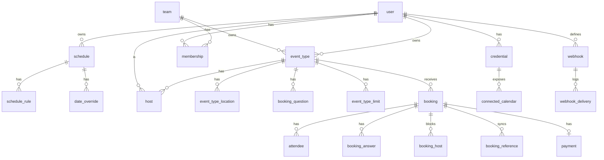

# Data model

Drizzle/PostgreSQL table design for OpenCalendar, with milestones, indexes and double-booking protection.

Last updated: 2026-09-28

Principles ([ADR-0002](../adr/0002-postgres-drizzle.md)):

- IDs: `text` primary keys holding UUIDv7 (time-ordered) generated in the app; Better Auth tables
  use its own string ids. Public identifiers (`booking.uid`) are separate random tokens.
- Instants: `timestamptz` in UTC (`timestamp('x', { withTimezone: true })`). Wall-clock rules:
  `time` + IANA `time_zone text`.
- Every table has `created_at`, `updated_at` (omitted below). Soft delete only where noted.
- Typed columns and child tables instead of JSON blobs. `jsonb` only for opaque provider data.
- Enums are `pgEnum`. Money is `integer` minor units + `char(3)` currency.
- Milestone tag: **M0**-**M6** is when the table is introduced (see [roadmap](../05-roadmap/roadmap.md)).

## Core ER diagram



## Auth (Better Auth) — M0

Generated with the Better Auth CLI, then owned in `db/schema/auth.ts` ([ADR-0004](../adr/0004-auth-better-auth.md)).

| Table | Columns |
|---|---|
| `user` | id text PK, name text, email text unique, email_verified bool, image text, **username** text unique (citext), **time_zone** text default 'UTC', **locale** text default 'en', **week_start** smallint default 1, **time_format** smallint (12/24), **default_schedule_id** text FK, **role** enum(`user`,`admin`), **disabled_at** timestamptz |
| `session` | id, user_id FK cascade, token text unique, expires_at, ip_address, user_agent |
| `account` | id, user_id FK, provider_id, account_id, access_token, refresh_token, id_token, access_token_expires_at, scope, password (hash for email+password) |
| `verification` | id, identifier, value, expires_at (email verify, magic link, reset) |

Login OAuth tokens in `account` are **not** used for calendars; calendar access uses `credential`.

`profile_settings` (M0, 1:1 with user): user_id PK/FK, bio text, brand_color text, dark_brand_color,
hide_branding bool (M6), redirect_url text, allow_dynamic_group bool (M4), theme enum(`system`,`light`,`dark`).

`login_attempt` (M0): id, email (lower-case), ip_address, created_at; index (email, created_at). Failed
password sign-ins for the lockout rule (AUTH-004), pruned every 15 min by `maintenance.prune-auth`.

`rate_limit` (M0): Better Auth's database rate-limit store (key, count, last_request ms), also used for
per-account limits (`acct:<path>:<email>` keys). Stale rows are pruned by the same maintenance job.

## Availability

| Table | Columns | M |
|---|---|---|
| `schedule` | id, user_id FK, name text, time_zone text not null, is_default bool | M1 |
| `schedule_rule` | id, schedule_id FK cascade, weekday smallint 0-6 (0=Sun), start_time time, end_time time, check `end_time > start_time OR end_time = '00:00'` (00:00 means 24:00) | M1 |
| `date_override` | id, schedule_id FK cascade, date date, start_time time null, end_time time null (both null = unavailable all day); multiple rows per date allowed | M1 |
| `out_of_office` | id, user_id FK, start_at timestamptz, end_at timestamptz, reason enum(`vacation`,`travel`,`sick`,`public_holiday`,`other`), note text, redirect_user_id FK null | M5 |

Index: `schedule_rule(schedule_id, weekday)`, `date_override(schedule_id, date)`, `out_of_office(user_id, start_at, end_at)`.

## Event types

`event_type` (M1; team columns M4):

| Column | Type | Notes |
|---|---|---|
| id | text PK | |
| owner_user_id | text FK null | personal event types |
| team_id | text FK null | check: exactly one of owner_user_id / team_id |
| parent_id | text FK null | managed event type child -> template (M4) |
| title, slug | text | unique (owner_user_id, slug) and (team_id, slug) |
| description | text | markdown |
| duration_minutes | integer | default duration, > 0 |
| slot_interval_minutes | integer null | null = duration |
| buffer_before_minutes, buffer_after_minutes | integer default 0 | |
| min_notice_minutes | integer default 0 | |
| horizon_type | enum(`rolling_days`,`rolling_business_days`,`date_range`,`unlimited`) | |
| horizon_days | integer null | for rolling types |
| range_start, range_end | date null | for `date_range` |
| schedule_id | text FK null | null = owner's default schedule |
| restriction_schedule_id | text FK null | intersected with hosts' availability (M3) |
| requires_confirmation | bool default false | M3 |
| confirmation_threshold_minutes | integer null | only require confirmation if booked within N min (M3) |
| seats_per_slot | integer null | null = not seated (M3) |
| seats_show_attendees | bool default false | M3 |
| recurrence_freq | enum(`weekly`,`monthly`) null, recurrence_max_count integer null | M3 |
| hidden | bool default false | not listed on profile |
| lock_time_zone | text null | force booker tz |
| scheduling_type | enum(`personal`,`collective`,`round_robin`,`managed`) | M4 for non-personal |
| rr_reset_period | enum(`never`,`day`,`week`,`month`) default `month` | fairness window (M4) |
| price_amount integer null, price_currency char(3) null | | M5 |
| success_redirect_url | text null | M3 |
| event_name_template | text null | e.g. `{EVENT} with {ATTENDEE}` |
| position | integer | ordering on profile page |
| deleted_at | timestamptz null | soft delete (bookings keep FK) |

Child tables:

| Table | Columns | M |
|---|---|---|
| `event_type_duration_option` | event_type_id FK, duration_minutes int; PK(event_type_id, duration_minutes) | M1 |
| `event_type_location` | id, event_type_id FK, kind enum(`in_person`,`phone_host`,`phone_attendee`,`link`,`google_meet`,`ms_teams`,`zoom`,`jitsi`), value text null (address/URL/phone), credential_id FK null, position int, display_on_booking bool | M2 (M1 stores its single basic location as `event_type.location_kind` + `location_value`, EVT-007; M2 migrates it into this table) |
| `booking_question` | id, event_type_id FK, key text (unique per event type), label text, type enum(`short_text`,`long_text`,`number`,`email`,`phone`,`select`,`multiselect`,`radio`,`checkbox`,`boolean`,`url`,`address`), required bool, hidden bool, placeholder text, options text[] null, email_domain_allow text[] null, email_domain_block text[] null, position int | M3 |
| `event_type_limit` | id, event_type_id FK null, user_id FK null (global per-user limit), period enum(`day`,`week`,`month`,`year`), kind enum(`count`,`duration`), value int (count or minutes); unique(event_type_id, period, kind) | M3 |
| `host` | event_type_id FK, user_id FK, is_fixed bool (RR: always included), weight int default 100, priority smallint 0-4 default 2, schedule_id FK null, group_key text null (RR host group); PK(event_type_id, user_id) | M4 (personal event types get an implicit single host row in M1) |
| `single_use_link` | id, event_type_id FK, token_hash text unique, expires_at null, max_uses int default 1, used_count int | M3 |

## Bookings

`booking` (M1):

| Column | Type | Notes |
|---|---|---|
| id | text PK | internal |
| uid | text unique | public, 22-char random (128 bits) |
| manage_token_hash | text | SHA-256 of the 256-bit manage token emailed to the booker (BKG-011); the token itself is never stored |
| ical_uid, sequence | text, int | stable iCalendar UID shared across reschedules; SEQUENCE bumps on every change (NTF-003) |
| buffer_before_minutes, buffer_after_minutes | int | buffers in effect when booked (they are part of the host's blocked range) |
| event_type_id | text FK | |
| organizer_id | text FK user | primary host (chosen RR host, or owner) |
| status | enum(`accepted`,`pending`,`awaiting_payment`,`cancelled`,`rejected`) | |
| start_at, end_at | timestamptz | check `end_at > start_at` |
| time_zone | text | booker's tz at booking time (emails) |
| title | text | rendered from template |
| location_kind, location_value | enum, text | chosen location; meeting URL filled by worker |
| recurring_series_id | text null | same value for all occurrences (M3) |
| rescheduled_from_id | text FK null | previous booking (old one gets `cancelled` + `rescheduled=true`) |
| rescheduled | bool default false | |
| cancellation_reason, rejection_reason | text null | |
| cancelled_by | enum(`attendee`,`host`,`system`) null | |
| no_show_host | bool default false | M3 |
| idempotency_key | text null | unique (event_type_id, idempotency_key) |
| routing_form_response_id | text FK null | M4 |
| source | enum(`web`,`embed`,`api`,`reschedule`) | analytics |
| utm | text columns utm_source/medium/campaign null | M5 |

| Table | Columns | M |
|---|---|---|
| `attendee` | id, booking_id FK cascade, name, email (citext), time_zone, locale, phone text null, no_show bool, seat_ref text null (seated bookings, M3), is_guest bool | M1 |
| `booking_answer` | booking_id FK, question_id FK null, key text, value_text text null, value_list text[] null; PK(booking_id, key) — label snapshot stored so editing questions does not rewrite history | M3 |
| `booking_host` | booking_id FK cascade, user_id FK, blocked_start / blocked_end timestamptz (**booking time plus its buffers**), active bool; PK(booking_id, user_id) (see below) | M1 |
| `booking_reference` | id, booking_id FK, provider text, credential_id FK null, external_calendar_id text, external_event_id text, meeting_url text null, meeting_id text null, sync_status enum(`pending`,`synced`,`failed`), last_error text | M2 |
| `slot_reservation` | id, event_type_id FK, user_id FK, start_at, end_at, session_token_hash (unique), expires_at (5 min, BKG-006) | M1 |

Indexes: `booking(organizer_id, start_at)`, `booking(event_type_id, start_at)`,
`booking(status, start_at)` partial where status in (`accepted`,`pending`),
`booking(recurring_series_id)`, `attendee(booking_id)`, `attendee(email)`,
GiST `booking_host(user_id, during)`.

## Integrations

| Table | Columns | M |
|---|---|---|
| `credential` | id, user_id FK null, team_id FK null, provider text (`google`,`microsoft`,`caldav`,`ics_feed`,`zoom`,`stripe`), kind enum(`calendar`,`conferencing`,`payment`), account_label text (email), encrypted_payload text (AES-256-GCM of token JSON / password, see integrations.md), expires_at timestamptz null, invalid_at timestamptz null (needs reauth), scopes text[] | M2 |
| `connected_calendar` | id, credential_id FK cascade, external_id text, name text, color text, check_conflicts bool default true, read_only bool, sync_token text null, watch_channel_id text null, watch_expires_at timestamptz null; unique(credential_id, external_id) | M2 |
| `destination_calendar` | id, user_id FK null, event_type_id FK null, connected_calendar_id FK; unique(user_id) where event_type_id null; unique(event_type_id) | M2 |
| `calendar_busy_cache` | connected_calendar_id FK, window_start timestamptz, window_end timestamptz, intervals tstzmultirange, fetched_at timestamptz, expires_at timestamptz; PK(connected_calendar_id, window_start) | M2 |

## Teams and routing (M4, as built)

| Table | Columns |
|---|---|
| `team` | id, name, slug unique (public page `/team/{slug}`), logo_url (https only), brand_color |
| `membership` | team_id FK cascade, user_id FK cascade, role enum(`owner`,`admin`,`member`), created_at; PK(team_id, user_id). Accepted members only |
| `team_invitation` | id, team_id FK cascade, email (lower-case), role, invited_by FK null, expires_at (14 days); unique(team_id, email) |
| `event_type` (team columns) | team_id FK null cascade, scheduling_type enum(`collective`,`round_robin`,`managed`) — set exactly when team_id is; parent_id FK null cascade (a member's managed copy → template); locked_fields jsonb string[] (template only); round_robin_window_days (1–365, default 30). `owner_user_id` of a team event type is its creator; slugs are unique per owner for personal types and per team for team types (partial unique indexes) |
| `event_type_host` | event_type_id FK cascade, user_id FK cascade, is_fixed, weight (1–1000, default 100), priority (0–4, default 2), schedule_id FK null (null = the host's default schedule), position; PK(event_type_id, user_id) |
| `booking` (M4 columns) | assignment_reason text null (round-robin "why this host"), routing_form_response_id FK null |
| `profile_settings.allow_dynamic_group` | bool, default false: opt-in for dynamic group links (TEAM-009) |
| `workflow.team_id` | FK null cascade; exactly one of event_type_id / team_id (a team workflow applies to all the team's event types and managed copies, NTF-007) |
| `routing_form` | id, owner_user_id FK (creator), team_id FK null, name, description, fields jsonb, rules jsonb, fallback jsonb, disabled |
| `routing_form_response` | id, form_id FK cascade, answers jsonb, trace jsonb (rule id + matched per evaluated rule), matched_rule_id (null = fallback), action jsonb, created_at |

Deviations from the draft above:
- **Routing rules are validated JSON, not child tables.** Fields, rules and the fallback are always
  read and written as a whole by one editor, and each response stores its own trace and action,
  so later edits never change what a past submission meant. The Zod schema
  (`features/routing-forms/schemas.ts`) enforces the shapes, keys and operator values.
- **Invitations are a separate table** keyed by email, so people without an account can be
  invited; accepting needs a signed-in user with the *verified* invited address (no bearer
  token), and grants no more than the inviter still holds.
- **Collective bookings** insert one `booking_host` row per host (the exclusion constraint is per
  user); round robin inserts the chosen host plus any fixed hosts. `booking.organizer_id` is the
  round-robin pick or the first collective host; host-side screens use "is a host of this booking"
  (`isHostOf`) instead of `organizer_id = me`.
- **Team resources survive their creator:** when a member leaves or deletes their account, their
  team event types, team workflows and team routing forms are handed to a remaining member
  (`features/teams/server/handover.ts`), and member copies of managed types are detached (kept,
  switched off) rather than deleted.

## Booking power features (M3, as built)

| Table / columns | Purpose |
|---|---|
| `event_type` + `requires_confirmation`, `confirmation_threshold_minutes` | EVT-011: bookings start `pending` (optionally only when starting within N minutes); pending bookings block time |
| `event_type` + `seats_per_slot`, `seats_show_attendees` | EVT-012: one booking per slot, one `attendee` per seat |
| `event_type` + `recurring_frequency` (`weekly`/`monthly`), `recurring_max_count` (2–52) | EVT-013 |
| `event_type` + `booking_limits`, `duration_limits` jsonb `{day?,week?,month?,year?}` (Zod-validated) | EVT-010, counted in the schedule's time zone, ISO weeks |
| `event_type` + `link_only`, `redirect_url`, `redirect_forward_params`, `event_name_template`, `disable_cancelling`, `disable_rescheduling`, `cancel_cutoff_minutes`, `lock_time_zone` | EVT-015/016/017 |
| `event_type_question` | id, event_type_id FK cascade, key (unique per event type, URL prefill name), type enum (11 types), label, placeholder, required, hidden, options jsonb, position (EVT-009) |
| `private_link` | id, event_type_id FK cascade, token_hash unique, encrypted_token (row id as AAD), expires_at, used_at, booking_id (EVT-015) |
| `booking` + `responses` jsonb, `utm` jsonb, `recurring_series_id` (indexed), `host_no_show`, `decided_at`, `rejection_reason` | EVT-009, BKG-014, EVT-013, BKG-013, BKG-012 |
| `attendee` + `seat_token_hash` (unique when set), `responses`, `no_show` | seat-level manage token and answers (EVT-012), BKG-013 |

Seats deliberately keep **one** `booking`/`booking_host` row per slot, so the exclusion constraint
still guarantees no double booking; each seat is an attendee with its own manage token. A seated
booking's own manage token is random and never emailed (a seat can only cancel itself).

## Automation (M3, as built)

Simpler than the original draft: one email step per workflow, attached to one event type; no
`scheduled_reminder` table.

| Table | Columns |
|---|---|
| `workflow` | id, owner_user_id FK, event_type_id FK cascade, name, trigger enum(`booking_created`,`booking_cancelled`,`booking_rescheduled`,`before_start`,`after_end`), offset_minutes (0–43200), recipient enum(`host`,`attendees`,`address`), address, subject, body, enabled, is_default |
| `webhook` | id, owner_user_id FK, event_type_id FK null (null = all), url, encrypted_secret (row id as AAD), triggers text[], active, payload_version |
| `webhook_delivery` | id, webhook_id FK cascade, trigger, payload jsonb, status enum(`pending`,`success`,`failed`), attempts, response_status, latency_ms, error |

Timed workflow steps are pg-boss jobs with `startAfter` and a deterministic id per (workflow,
booking, start). When they fire they re-check that the workflow is enabled and that the booking is
still active and still starts at the expected time, so reschedules and cancellations need no
bookkeeping. Team-scoped workflows arrived in M4 (`workflow.team_id`); team-scoped webhooks,
`booking_requested`/`no_show` workflow triggers and SMS steps are later milestones.

## Platform and enterprise-lite

| Table | Columns | M |
|---|---|---|
| `payment` | id, booking_id FK unique, provider text, external_id text (Checkout session / PaymentIntent), amount int, currency char(3), status enum(`pending`,`paid`,`refunded`,`failed`,`expired`), refunded_amount int | M5 |
| `api_key` | id, user_id FK, team_id FK null, name, prefix text (first 8 chars, shown), key_hash text unique (SHA-256 of full key), scopes text[], last_used_at, expires_at null, revoked_at null | M5 |
| `rate_limit_bucket` | key text PK (`ip:...`, `key:...`), tokens real, refilled_at timestamptz; `UNLOGGED` table, custom migration | M3 |
| `audit_log` | id bigserial, actor_user_id FK null, actor_api_key_id FK null, team_id null, action text (`booking.cancel`, `member.role_change` ...), target_type, target_id, ip inet, user_agent text, metadata jsonb, created_at; append-only (no UPDATE/DELETE grants) | M6 |

## Double-booking protection

Slots are computed optimistically; correctness is enforced at write time in three layers.

1. **Advisory lock.** `createBooking` opens a transaction and calls
   `pg_advisory_xact_lock(hashtext('host:' || user_id))` for every candidate host, in sorted
   order (avoids deadlocks). Concurrent bookings for the same host serialize; different hosts
   run in parallel.
2. **Re-validate inside the transaction.** Reload that host's bookings, holds, limits and cached
   busy times for the slot window and run `isSlotAvailable()` from the pure engine (including
   buffers, limits and seat counts). Round-robin host selection happens here.
3. **Exclusion constraint (last line of defense).** One `booking_host` row per (booking, host)
   stores the host's blocked range, `[start - buffer_before, end + buffer_after)`, and `active`.
   The custom migration `0003_booking_no_overlap.sql` adds:

```sql
ALTER TABLE booking_host
  ADD CONSTRAINT booking_host_no_overlap
  EXCLUDE USING gist (user_id WITH =, tstzrange(blocked_start, blocked_end, '[)') WITH &&)
  WHERE (active);
```

- **Buffers are inside the blocked range.** This is exactly the engine's rule (a candidate plus
  its own buffers may not overlap an existing booking plus its buffers), so EVT-003 ("buffers
  block the host's time for every event type") and NFR-004 are enforced by the database too.
  *(Changed during M1: the original draft kept buffers out of the constraint.)*
- `active` is true for `accepted`, `pending` and `awaiting_payment` bookings and false for
  cancelled/rejected ones. Status changes update `active` in the same transaction; a reschedule
  deactivates the old row **before** inserting the new one, so a booking can move into its own
  former slot.
- Seated event types (M3) will not insert one active row per attendee; the seat count is checked
  under the advisory lock instead. Collective bookings (M4) insert one row per host.
- A violation raises SQLSTATE `23P01`, mapped to `SLOT_UNAVAILABLE`.
- Covered by `tests/integration/bookings.int.test.ts`: 50 parallel bookings for one slot produce
  exactly one booking, and a direct overlapping write is rejected by the constraint.

Idempotency: `booking(event_type_id, idempotency_key)` unique; a retried submit returns the
existing booking instead of creating a second one.

## Retention and deletion

- User deletion cascades personal data; bookings where the user is organizer are anonymized
  for other hosts (see [security.md](./security.md#privacy-gdpr)).
- `webhook_delivery` older than 30 days and `calendar_busy_cache` past `expires_at` are purged
  by `maintenance.cleanup`.
