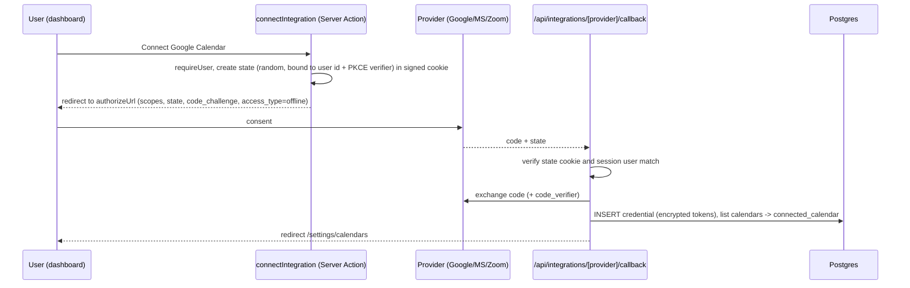

# Integrations

Adapter interfaces, registry, OAuth and credential handling, and provider notes for calendars, video and payments.

Last updated: 2026-09-28

Core code never imports a provider SDK directly. It talks to three small interfaces defined in
`lib/integrations/types.ts`, and looks providers up in a plain TypeScript map. Strategy rationale:
[ADR-0006](../adr/0006-caldav-first-calendar-strategy.md). Tables: `credential`,
`connected_calendar`, `destination_calendar`, `calendar_busy_cache`, `booking_reference`
([data-model.md](./data-model.md#integrations)).

## Adapter interfaces

```ts
// lib/integrations/types.ts (illustrative)
export interface ProviderContext {
  credential: DecryptedCredential;           // tokens or username/password, already decrypted
  saveCredential(next: DecryptedCredential): Promise<void>; // after token refresh
  fetch: SafeFetch;                           // timeouts, SSRF-safe for user-supplied URLs
  log: Logger;
}

export interface ExternalCalendar { externalId: string; name: string; color?: string; readOnly: boolean; primary?: boolean }
export interface BusyInterval { start: Date; end: Date; externalEventId?: string }
export interface CalendarEventInput {
  title: string; description: string; start: Date; end: Date; timeZone: string;
  organizer: { name: string; email: string };
  attendees: { name: string; email: string }[];
  location?: string; conference?: 'google_meet' | 'ms_teams';
  uid: string;                                // booking uid, used as iCal UID for idempotency
}
export interface CreatedEvent { externalEventId: string; meetingUrl?: string; meetingId?: string }

export interface CalendarAdapter {
  listCalendars(ctx: ProviderContext): Promise<ExternalCalendar[]>;
  getBusy(ctx: ProviderContext, calendarIds: string[], range: { start: Date; end: Date }): Promise<Record<string, BusyInterval[]>>;
  createEvent(ctx: ProviderContext, calendarId: string, e: CalendarEventInput): Promise<CreatedEvent>;
  updateEvent(ctx: ProviderContext, calendarId: string, externalEventId: string, e: CalendarEventInput): Promise<CreatedEvent>;
  deleteEvent(ctx: ProviderContext, calendarId: string, externalEventId: string): Promise<void>;
  watch?(ctx: ProviderContext, calendarId: string, callbackUrl: string): Promise<{ channelId: string; expiresAt: Date }>;
  unwatch?(ctx: ProviderContext, channelId: string): Promise<void>;
}

export interface ConferencingAdapter {
  createMeeting(ctx: ProviderContext, m: { title: string; start: Date; end: Date; uid: string }): Promise<{ url: string; meetingId: string; password?: string }>;
  updateMeeting?(ctx: ProviderContext, meetingId: string, m: { start: Date; end: Date }): Promise<void>;
  deleteMeeting(ctx: ProviderContext, meetingId: string): Promise<void>;
}

export interface PaymentAdapter {
  createCheckout(ctx: ProviderContext, p: { bookingUid: string; amount: number; currency: string; successUrl: string; cancelUrl: string; customerEmail: string }): Promise<{ redirectUrl: string; externalId: string; expiresAt: Date }>;
  handleWebhook(req: Request, secret: string): Promise<PaymentEvent | null>; // verifies signature
  refund(ctx: ProviderContext, externalId: string, amount?: number): Promise<void>;
}

export interface ProviderDefinition {
  id: 'google' | 'microsoft' | 'caldav' | 'ics_feed' | 'zoom' | 'jitsi' | 'stripe';
  name: string; icon: string;
  kinds: ('calendar' | 'conferencing' | 'payment')[];
  auth: { type: 'oauth2'; authorizeUrl: string; tokenUrl: string; scopes: string[] } | { type: 'basic' } | { type: 'url' } | { type: 'none' } | { type: 'api_key' };
  isConfigured(env: Env): boolean;            // hides providers without env vars
  calendar?: CalendarAdapter; conferencing?: ConferencingAdapter; payment?: PaymentAdapter;
  credentialSchema: z.ZodType;                 // shape of the decrypted payload
}
```

Errors are normalized to `IntegrationError` with `kind: 'auth' | 'rate_limited' | 'not_found' | 'transient' | 'invalid'`.
`auth` marks `credential.invalid_at` and emails the user to reconnect; `transient` and
`rate_limited` are retried by pg-boss.

## Registry

```ts
// lib/integrations/registry.ts
import { google } from './google';
import { microsoft } from './microsoft';
import { caldav } from './caldav';
import { icsFeed } from './ics-feed';
import { zoom } from './zoom';
import { jitsi } from './jitsi';
import { stripe } from './stripe';

export const providers = { google, microsoft, caldav, ics_feed: icsFeed, zoom, jitsi, stripe } as const satisfies Record<string, ProviderDefinition>;
export type ProviderId = keyof typeof providers;
export function getProvider(id: string): ProviderDefinition { /* throws on unknown id */ }
```

No code generation, no dynamic imports from user input, no per-app `config.json` scanning
(contrast with Cal.com's generated app-store registries in [../01-research/calcom.md](../01-research/calcom.md)).

## OAuth flow and token refresh



- Calendar OAuth is separate from login OAuth ([ADR-0004](../adr/0004-auth-better-auth.md)).
- Callback URL is `${APP_URL}/api/integrations/{provider}/callback`, computed at runtime.
- **Refresh**: before each call, if `expires_at < now + 60 s`, refresh under a Postgres advisory
  lock keyed by credential id (prevents two workers refreshing and invalidating each other's
  rotating refresh tokens), then `saveCredential`. A refresh failure with `invalid_grant` marks
  the credential invalid.
- Scopes are minimal and listed per provider below.

## Credential encryption

- Algorithm: **AES-256-GCM** (Node `crypto`), random 12-byte IV per encryption, 16-byte tag.
- Stored as text `v1:<iv>:<tag>:<ciphertext>` (base64 parts) in `credential.encrypted_payload`.
- Key: `ENCRYPTION_KEY` (32 bytes, base64). Optional `ENCRYPTION_KEY_PREVIOUS` for rotation:
  decryption tries the current key, then the previous one. `node cli.js rotate-keys` re-encrypts
  every stored secret under the current key; after that the previous key can be removed.
- AAD (additional authenticated data) = `credential.id`, so ciphertext cannot be swapped between rows.
- Decrypted payloads never leave the server, are never logged, and are validated with the
  provider's `credentialSchema`. Details in [security.md](./security.md#secrets-and-credential-encryption).

## Provider notes

### Google Calendar (M2)

- Google Calendar API v3 via `googleapis` or direct REST with `fetch`.
- Scopes: `calendar.readonly` (list, busy) and `calendar.events` (write). Request
  `access_type=offline` and `prompt=consent` to get a refresh token.
- Busy: `freebusy.query` for up to 50 calendars per request.
- Create: `events.insert` with `sendUpdates=none` (we send our own emails; configurable).
- **Google Meet**: pass `conferenceData.createRequest` with `conferenceSolutionKey.type = "hangoutsMeet"`
  and a unique `requestId` (booking uid), plus `conferenceDataVersion=1`; read the link from
  `hangoutLink`/`conferenceData.entryPoints`.
- Push (M5): `events.watch` channels expire (max ~1 month); `calendar.renew-watch` renews daily.
  Inbound notifications hit `/api/webhooks/google` and only invalidate the busy cache.

### Microsoft 365 / Outlook (M2)

- Microsoft Graph REST. Scopes: `offline_access`, `Calendars.ReadWrite`, `User.Read`
  (`OnlineMeetings.ReadWrite` only if needed for standalone meetings).
- Busy: `POST /me/calendar/getSchedule` or `calendarView` for selected calendars; treat
  `busy`, `oof`, `tentative` (configurable) and `workingElsewhere` (configurable) as busy.
- **Teams**: create the event with `isOnlineMeeting: true` and
  `onlineMeetingProvider: "teamsForBusiness"`; read `onlineMeeting.joinUrl`.
- Push (M5): Graph subscriptions on `/me/events`, renewed before expiry.
- Multi-tenant app registration; `MICROSOFT_TENANT_ID` defaults to `common`.

### CalDAV (M2) — tsdav

- `createDAVClient({ serverUrl, credentials: { username, password }, authMethod: 'Basic', defaultAccountType: 'caldav' })`.
- Presets: **iCloud** (`https://caldav.icloud.com`, Apple ID + app-specific password),
  **Fastmail** (`https://caldav.fastmail.com/dav/`, app password), **Nextcloud**
  (`https://host/remote.php/dav`, app password), generic URL.
- `listCalendars` = `fetchCalendars`, filtered to calendars supporting `VEVENT`.
- `getBusy` = `fetchCalendarObjects({ calendar, timeRange, expand: true })`, parse with an
  iCal parser, ignore `TRANSP:TRANSPARENT` and `STATUS:CANCELLED`, convert to UTC intervals.
  `freeBusyQuery` is not used because Google and Apple do not support it (tsdav docs).
- Write = `createCalendarObject({ calendar, filename: `${uid}.ics`, iCalString })` using the
  `ics` library; update/delete by object URL stored in `booking_reference`.
- User-supplied server URLs go through the SSRF-safe fetch (block private ranges unless
  `ALLOW_PRIVATE_NETWORK_INTEGRATIONS=true` for LAN Nextcloud installs).

### ICS feed, read-only (M2)

- User pastes a secret `.ics` URL (e.g. from a work calendar that cannot be connected).
- `getBusy` downloads (max 5 MB, 10 s timeout, SSRF-safe), expands recurrences in the window,
  caches for 15 min. No write support; cannot be a destination calendar.

### Zoom (M2)

- OAuth app (user-managed). Scopes: `meeting:write`, `meeting:read`, `user:read`.
- `createMeeting` = `POST /users/me/meetings` (type 2, scheduled), `deleteMeeting` on cancel,
  `updateMeeting` on reschedule.

### Jitsi and custom link (M1/M2)

- Jitsi needs no credential: meeting URL = `${JITSI_BASE_URL ?? 'https://meet.jit.si'}/${slug}-${random}`.
- "Link" location is a static URL entered by the host (Whereby room, own Jitsi, etc.).

### Stripe Checkout (M5)

- Per-user Stripe account via Stripe Connect OAuth (Standard) on hosted installs, or a single
  instance-wide `STRIPE_SECRET_KEY` for self-hosted single-organization installs.
- Flow: booking inserted as `awaiting_payment` -> `createCheckout` (Checkout Session,
  `expires_at` 30 min, metadata `bookingUid`) -> redirect -> `/api/webhooks/stripe` verifies the
  `Stripe-Signature` with `STRIPE_WEBHOOK_SECRET` -> `payment.reconcile` job marks paid,
  sets booking `accepted` (or `pending` if confirmation required), emits `booking.paid`.
- `checkout.session.expired` or `booking.expire-pending` cancels the booking and frees the slot.
- `refund` on host cancellation according to the event type's refund policy.

## Sync strategy

1. **On-demand free/busy** (M2): when slots are requested, fetch busy intervals for each
   `connected_calendar` with `check_conflicts = true` for the requested window, cache in
   `calendar_busy_cache` for 2 minutes. Parallel fetch with 4 s timeout; stale cache on timeout;
   fail closed if nothing cached ([availability-engine.md](./availability-engine.md#caching-strategy)).
2. **Write-through on booking**: after our own booking is written to the external calendar,
   the cache entry for that window is invalidated.
3. **Push** (M5, optional): Google watch channels and Graph subscriptions invalidate the cache
   immediately, allowing a longer TTL (15 min). Requires a public HTTPS `APP_URL`; disabled
   automatically otherwise.
4. **No full event mirroring.** We store busy intervals, not event titles (titles only appear in
   the owner-only troubleshooter, fetched live).

## M2 implementation notes

What was built, and where it differs from the draft above:

| Area | Implementation |
|---|---|
| Adapters | `lib/integrations/{google,microsoft,zoom,caldav}.ts`, plain `fetch` (no SDKs); registry is a typed map (`registry.ts`). `getBusy` also takes the host's time zone for floating/all-day values. |
| Google busy | `events.list` (`singleEvents=true`) instead of `freeBusy`, because event ids are needed to recognize our own events. Create uses a deterministic event id derived from the booking iCal UID (idempotent retries; 409 → read back). `sendUpdates=none`. All-day events are read in the host's zone; events the user declined don't block. |
| Microsoft | `calendarView` with `Prefer: outlook.timezone="UTC"`; `showAs` busy/oof/tentative/workingElsewhere/unknown block. **Events are created without attendees** (Outlook would send its own invitations); attendees are listed in the body. `transactionId` = iCal UID for idempotency. |
| CalDAV | `tsdav` with the SSRF-safe fetch injected; `calendar-query` + local expansion with `ical.js` (RRULE/EXDATE/RECURRENCE-ID, VTIMEZONE, IANA fallback, all-day in host zone). Objects are stored as `<uid>.ics` without `METHOD`; 412 on create → update. Recurrence expansion has a per-call budget and fails closed for what it can't expand. https is required unless private networks are allowed. Verified against Radicale (Testcontainers + E2E). |
| ICS feed | Read-only; validated on connect by parsing it. The feed URL is a secret: it lives only in the encrypted credential; the calendar row's `external_id` is the constant `feed`. Labels are `host · sha256(url)[0..8]`. |
| Connect | The credential is verified (calendar list) **before** anything is written, so a failed reconnect never replaces a working credential. One credential per (user, provider, label) — unique index + upsert. An empty calendar list from a provider never deletes existing calendars. |
| SSRF | User-supplied URLs (CalDAV, ICS) go through `createSafeFetch`: private/loopback/link-local/NAT64/6to4/documentation ranges blocked before the request **and again in the socket's DNS lookup** (undici `Agent`, defeats DNS rebinding); every redirect re-checked; `Authorization`/cookies dropped on cross-origin redirects; timeout and size cap. |
| Credentials | AES-256-GCM with **the row id as AAD** (`credential.encrypted_payload`), refresh under `pg_advisory_xact_lock('credential:<id>')`; an `auth` error marks `invalid_at`, emails the owner once, and the calendar is skipped (never fails closed). |
| OAuth | `/api/integrations/[provider]/connect` → PKCE + state in an encrypted, HttpOnly, 10-minute cookie bound to the signed-in user → `/callback` verifies state/provider/user, exchanges the code, stores the credential. Microsoft endpoints use `MICROSOFT_TENANT_ID`. |
| Busy cache | `calendar_busy_cache` per calendar and exact window; any fresher row covering a smaller window is reused. Windows are snapped to whole UTC days (slot display is also clamped to now−1 day … now+2 years) so arbitrary client windows share entries. TTL 2 min (Google/Microsoft), 5 min (CalDAV/ICS); booking and holding accept at most 30 s old data. Stale data (≤ 6 h) on provider errors; **fail closed** (whole window busy) otherwise. Own events (by `booking_reference.external_id` or `<icalUid>@<APP_URL host>`) are filtered out. Pruned daily by the maintenance job. |
| Side effects | `booking.process` job, **enqueued inside the booking transaction** (`fromDrizzle(tx)`), runs calendar/meeting sync first and then queues the emails, so Meet/Teams/Zoom links are in the invitation. Cancellations enqueue the same job inside the cancelling transaction. The job is idempotent: existing references are reused or retried in place, reschedules adopt the references of the whole reschedule chain, transient provider errors throw so pg-boss retries (emails wait for the last attempt at most), email jobs get deterministic ids (no duplicates on retry), and a booking cancelled before or during the sync gets nothing created (or it is removed again). |
| Locations | `event_type_location` (EVT-008); Jitsi rooms are generated per booking (`JITSI_BASE_URL`); `phone_attendee` collects an E.164 number; Meet/Teams need the destination calendar of that provider, Zoom a connected Zoom account. |
| Hot path (NFR-001) | Slot display only: host/event type/schedule cached 10 s per process (cleared by the host's own saves in that process), external busy memoized 5 s, in-process per-IP limiter. Booking and holding always re-read everything. |

Not verified end to end: live Google, Microsoft and Zoom accounts (requires registered OAuth apps). Their request/response contracts are covered by `lib/integrations/providers.test.ts`, and the full sync logic by `tests/integration/calendars.int.test.ts` against in-memory fakes.

## Checklist: adding a new integration

1. Create `lib/integrations/<provider>/index.ts` exporting a `ProviderDefinition`.
2. Implement only the interfaces it supports; unit test against recorded HTTP fixtures (msw).
3. Define `credentialSchema` (Zod) and the auth type; add env vars to `lib/env.ts` (optional,
   provider hidden when missing) and to [self-hosting.md](./self-hosting.md#environment-variables).
4. Register it in `lib/integrations/registry.ts` (one line).
5. Add its location kind to `event_type_location.kind` enum if it is conferencing (migration).
6. Map provider errors to `IntegrationError` kinds; honor rate-limit headers.
7. Route all user-supplied URLs through `SafeFetch`.
8. Add icon (`public/integrations/<provider>.svg`), i18n strings (en, tr), setup docs in
   `docs/04-development/`.
9. Add an integration test (container or sandbox account) and an entry in the compatibility matrix.
10. Security review: scopes minimal, tokens encrypted, nothing logged.
