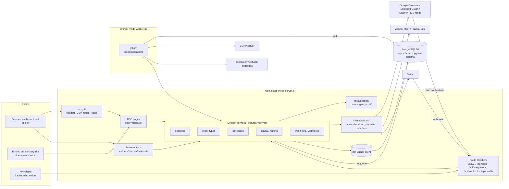
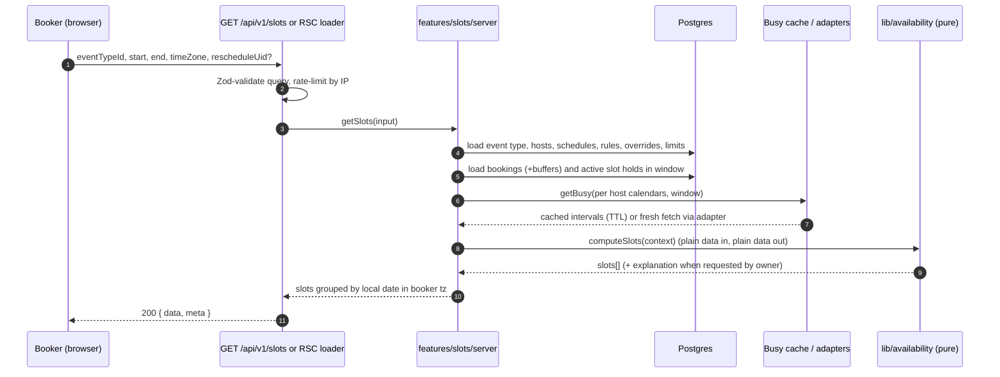
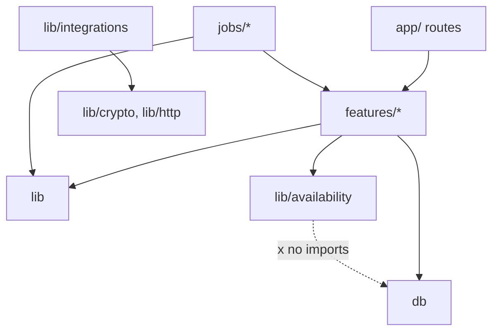

# System overview

Components, request flows, background jobs, folder layout and module boundaries of OpenCalendar.

Last updated: 2026-09-28

OpenCalendar is a single Next.js 16 App Router application backed by PostgreSQL, with a
pg-boss worker running from the same Docker image ([ADR-0003](../adr/0003-self-host-first-single-app.md)).
Requirements are in [../02-product/requirements.md](../02-product/requirements.md); stack
choices in [tech-stack.md](./tech-stack.md).

## Component diagram



## Request flow: get slots

Public booker asks for slots for one event type in a date window. Details of the engine are in
[availability-engine.md](./availability-engine.md).



## Request flow: create booking

```mermaid
sequenceDiagram
  autonumber
  participant Br as Booker
  participant SA as createBooking (Server Action) / POST /api/v1/bookings
  participant B as features/bookings/server
  participant E as lib/availability
  participant DB as Postgres (transaction)
  participant Q as pg-boss
  participant W as Worker

  Br->>SA: eventTypeId, start, attendee, answers, idempotencyKey
  SA->>SA: Zod-validate, rate-limit, bot check
  SA->>B: createBooking(input)
  B->>DB: return existing booking if idempotency key seen
  B->>DB: BEGIN; pg_advisory_xact_lock(hash(host or event type))
  B->>DB: reload bookings/holds for candidate hosts
  B->>E: isSlotAvailable(...) and pickHost(...) for round robin
  alt slot no longer free
    B-->>SA: SlotUnavailableError
    SA-->>Br: 409 slot_taken (UI refreshes slots)
  else free
    B->>DB: INSERT booking, attendees, answers, booking_host rows
    Note over DB: exclusion constraint on booking_host<br/>rejects any overlap that slipped through
    B->>DB: INSERT outbox jobs (pg-boss send in same tx)
    B->>DB: COMMIT
    B-->>SA: booking (uid, status)
    SA-->>Br: redirect to /booking/{uid}
    Q->>W: calendar.sync-booking, email.send, webhook.deliver, reminder.fire (delayed)
    W->>W: create external event + meeting link, store booking_reference
  end
```

External calls (calendar write, video meeting creation, emails) happen **after commit** in the
worker, so a slow provider never holds a database lock and a provider outage never loses a
booking. The confirmation email is sent after the meeting link exists (the
`calendar.sync-booking` job enqueues `email.send` on success, or sends without a link after the
final retry). Paid event types insert the booking as `awaiting_payment` and redirect to Stripe
Checkout instead (see [integrations.md](./integrations.md)).

## Background jobs

All queues are pg-boss queues ([ADR-0005](../adr/0005-jobs-pg-boss-no-redis.md)); handlers
are idempotent.

| Queue | Trigger | Work | Retry policy | Milestone |
|---|---|---|---|---|
| `email.send` | booking events, auth emails | Render React Email, send via SMTP, attach ICS | 5, backoff | M0 |
| `calendar.sync-booking` | booking create/reschedule/cancel | Create/update/delete external event, create meeting, store `booking_reference` | 6, backoff | M2 |
| `calendar.refresh-busy` | cron every 5 min for recently viewed users; push notifications | Refresh `calendar_busy_cache` | 3 | M2 |
| `calendar.renew-watch` | cron daily | Renew Google channels / Graph subscriptions | 3 | M5 |
| `reminder.fire` | delayed `startAfter` per workflow step | Send email/SMS reminder, mark `scheduled_reminder` sent | 3 | M3 |
| `webhook.deliver` | domain events | POST signed payload, log `webhook_delivery` | 8, exponential backoff, dead letter | M3 |
| `booking.expire-pending` | delayed | Auto-reject unconfirmed or unpaid bookings after timeout | 3 | M3 |
| `slot-hold.cleanup` | part of `maintenance.prune-auth` (every 15 min) | Delete expired `slot_reservation` rows (expired holds are already ignored by the engine) | 1 | M1 |
| `payment.reconcile` | Stripe webhook | Mark paid, confirm booking, emit `booking.paid` | 5 | M5 |
| `meeting.ended` | delayed to booking end | Emit `meeting.ended` webhook, trigger after-event workflows | 3 | M3 |
| `maintenance.cleanup` | cron nightly | Purge expired sessions, verification tokens, old deliveries (retention) | 1 | M0 |
| `gdpr.export` | user request | Build JSON export, email download link | 3 | M5 |

## Folder structure

```text
.
├── app/                         # Routes only: thin, call features/*
│   ├── (marketing)/             # optional landing
│   ├── (auth)/login, signup, verify
│   ├── (dashboard)/             # event-types, availability, bookings, settings, teams, admin
│   ├── [user]/[slug]/           # public booking page: /alice/intro-call
│   ├── team/[team]/[slug]/      # team booking pages
│   ├── booking/[uid]/           # confirmation, cancel, reschedule
│   ├── embed/                   # embed-optimized booker routes
│   └── api/
│       ├── auth/[...all]/route.ts         # Better Auth handler
│       ├── v1/**/route.ts                 # public REST API
│       ├── integrations/[provider]/callback/route.ts
│       ├── webhooks/stripe/route.ts, webhooks/google/route.ts, webhooks/microsoft/route.ts
│       └── health/route.ts
├── features/                    # Vertical slices by domain
│   └── <domain>/                # bookings, event-types, schedules, slots, teams, routing,
│       ├── server/              #   workflows, webhooks, payments, api-keys, admin ...
│       │   ├── actions.ts       # 'use server' Server Actions (auth + validation + call service)
│       │   ├── service.ts       # domain logic, transactions
│       │   └── repository.ts    # Drizzle queries for this domain
│       ├── components/          # React components (server and client)
│       └── schemas.ts           # Zod schemas shared by actions, API and forms
├── lib/
│   ├── availability/            # pure engine (no I/O, no Date.now())
│   ├── integrations/
│   │   ├── registry.ts          # plain map of providers
│   │   ├── types.ts             # CalendarAdapter, ConferencingAdapter, PaymentAdapter
│   │   └── <provider>/          # google, microsoft, caldav, ics-feed, zoom, jitsi, stripe
│   ├── auth/                    # Better Auth instance, requireUser(), permission helpers
│   ├── crypto/                  # AES-256-GCM encrypt/decrypt, HMAC signing
│   ├── email/                   # transport + React Email templates
│   ├── env.ts                   # Zod-validated runtime env
│   └── http/                    # API envelope, errors, rate limiter, SSRF-safe fetch
├── db/
│   ├── schema/*.ts              # Drizzle tables (one file per domain)
│   ├── migrations/              # drizzle-kit output + custom SQL
│   └── client.ts
├── jobs/                        # pg-boss queue definitions and handlers
├── worker.ts                    # worker entrypoint (bundled to worker.js)
├── proxy.ts                     # Next 16 proxy (formerly middleware)
├── instrumentation.ts           # optional inline worker (WORKER_MODE=inline)
├── messages/{en,tr}.json        # next-intl
├── tests/{integration,e2e}/
└── docs/
```

## Module boundaries and dependency rules



Rules (enforced with `eslint-plugin-boundaries` or `dependency-cruiser` in CI):

1. `app/` may import `features/*` and UI components only. No Drizzle queries in `app/`.
2. `features/<a>` may import `features/<b>/server/service.ts` public functions, never another
   feature's `repository.ts`. Cross-feature writes go through the owning service.
3. `lib/availability` imports **nothing** with I/O: no `db`, no `fetch`, no `process.env`,
   no `Date.now()`. "Now" is an input. It depends only on date-fns/`@date-fns/tz`.
4. `lib/integrations/<provider>` implements interfaces from `lib/integrations/types.ts` and must
   not import `features/*`. Providers receive decrypted credentials and return plain data.
5. `db/schema` has no business logic. Row types are inferred (`typeof table.$inferSelect`).
6. Server-only modules start with `import 'server-only'` to prevent leaking into client bundles.
7. Every Server Action and Route Handler: authenticate, validate with Zod, authorize (ownership
   or team role), then call a service. See [security.md](./security.md).
8. Jobs call the same services as actions; no duplicated business logic in `jobs/`.

## Related documents

- [data-model.md](./data-model.md)
- [availability-engine.md](./availability-engine.md)
- [integrations.md](./integrations.md)
- [api-and-webhooks.md](./api-and-webhooks.md)
- [security.md](./security.md)
- [self-hosting.md](./self-hosting.md)
