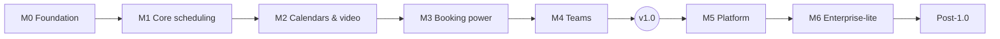

# Roadmap

The milestone plan from an empty repository to OpenCalendar v1.0 and beyond.

Last updated: 2026-09-28

Related: [Requirements](../02-product/requirements.md) · [Feature matrix](../01-research/feature-matrix.md) · [Implementation steps](../04-development/implementation-steps.md) · [Vision](../02-product/vision.md)

## Overview

| Milestone | Theme | Outcome ("done when…") | Size* |
|---|---|---|---|
| **M0** | Foundation | App boots from `docker compose up`, users can sign up and sign in, and CI is green | S |
| **M1** | Core scheduling (single user) | A solo user can publish a booking link and people can book, cancel and reschedule, with emails and ICS | L |
| **M2** | Calendars & video | Bookings respect busy times in Google, Microsoft and CalDAV calendars, and write events with meeting links | L |
| **M3** | Booking power features | Feature parity with a paid Calendly Standard plan: questions, limits, confirmation, seats, recurring, embeds, webhooks, reminders | L |
| **M4** | Teams | Collective, round robin, managed event types and routing forms, all in the open core | L |
| **v1.0** | Release | M0–M4 complete and meeting the v1.0 criteria below | — |
| **M5** | Platform | REST API, Stripe payments, insights, i18n (en/tr), polls, OOO | L |
| **M6** | Enterprise-lite | SSO, 2FA, SMS, audit log, instance admin, white-label | M |

\*Rough relative size (S/M/L). We deliberately don't commit to calendar dates. Each milestone ends with a tagged pre-release (`v0.<n>.0`).

**Why v1.0 comes after M4, before M5:** team scheduling is the gap Cal.diy left and Calendly charges for (see [landscape](../01-research/landscape.md)), so it must be in the first stable release. The public REST API and payments matter, but webhooks (M3) and embeds already cover most integration needs.

---

## M0 · Foundation

**Goal:** a deployable, tested skeleton with auth.

| Area | Requirements |
|---|---|
| Auth | AUTH-001 email+password, AUTH-002 magic link, AUTH-003 Google/Microsoft OAuth, AUTH-004 rate limiting, AUTH-005 signup mode + first-run admin |
| Platform | ADM-001 single image (web + worker), ADM-002 runtime config, ADM-003 CI, ADM-004 health endpoints, ADM-005 app shell and settings |
| Email | NTF-001 SMTP + pg-boss email queue |
| NFRs | NFR-006, NFR-007 (security baseline), NFR-013 (operability), NFR-017 (maintainability) |

**Status: done (2026-09-28).** See the verification notes in [implementation steps](../04-development/implementation-steps.md#m0--foundation).

**Exit criteria:** `docker compose up` on a clean machine leads to the sign-up page. The first user becomes admin. Emails show up in Mailpit. CI runs lint, typecheck, test and build.

## M1 · Core scheduling (single user)

**Goal:** the smallest thing that replaces Calendly Free for one person.

| Area | Requirements |
|---|---|
| Availability | AVL-001 schedules, AVL-002 date overrides, AVL-003 slot engine, AVL-004 DST, AVL-005 reason codes |
| Event types | EVT-001 CRUD, EVT-002 multiple durations, EVT-003 buffers, EVT-004 min notice, EVT-005 horizon, EVT-006 slot interval, EVT-007 basic location |
| Booking | BKG-001 profile page, BKG-002 booking page, BKG-003 tz detection, BKG-004 form, BKG-005 transactional no-double-booking, BKG-006 slot hold, BKG-007 confirmation page, BKG-008 cancel link, BKG-009 reschedule link, BKG-010 dashboard, BKG-011 unguessable tokens |
| Notifications | NTF-002 confirmation + ICS, NTF-003 cancel/reschedule ICS updates |
| Other | ADM-006 account deletion, I18N-001 `Intl` formatting |
| NFRs | NFR-004/005 correctness, NFR-008 accessibility, NFR-009 i18n-ready, NFR-011 reliability, NFR-012 footprint, NFR-014 backup/restore, NFR-018 compatibility |

**Status: done (2026-09-29).** See the verification notes in [implementation steps](../04-development/implementation-steps.md#m1--core-scheduling).

**Exit criteria:** E2E flows 1–4 and 8 from [testing](../04-development/testing.md) pass. Engine coverage is ≥ 90%. The concurrency test proves no double booking.

## M2 · Calendars & video

**Goal:** real-world usefulness. The host's existing calendars are respected and events are written back.

| Area | Requirements |
|---|---|
| Framework | INT-001 adapter framework, INT-012 credential health, INT-013 config-gated integrations |
| Calendars | INT-002 Google, INT-003 Microsoft 365, INT-004 CalDAV (iCloud/Fastmail/Nextcloud), INT-005 ICS feeds, INT-006 conflict calendars, INT-007 destination calendar |
| Availability | AVL-006 busy merge, AVL-007 busy cache |
| Locations | EVT-008 multiple typed locations, INT-008 Meet/Teams, INT-009 Zoom, INT-010 Jitsi/custom link, INT-011 in-person/phone |
| NFRs | NFR-001 slot API p95 < 300 ms, NFR-010 observability, NFR-016 graceful degradation when a provider is down |

**Exit criteria:** a Google-connected and an iCloud-connected account each block slots correctly and receive events with meeting links. Reschedule and cancel update or delete the external events.

**Status: done (2026-09-29), CalDAV verified against a real server; Google/Microsoft/Zoom verified with contract tests and fakes, not yet with live accounts.** See the verification notes in [implementation steps](../04-development/implementation-steps.md#m2--calendars--video).

## M3 · Booking power features

**Goal:** match what people pay Calendly Standard for, and ship our differentiator (explainability).

| Area | Requirements |
|---|---|
| Event types | EVT-009 booking questions, EVT-010 limits, EVT-011 requires confirmation, EVT-012 seats, EVT-013 recurring, EVT-014 hidden, EVT-015 single-use links, EVT-016 redirect, EVT-017 policies |
| Booking | BKG-012 accept/reject, BKG-013 no-show, BKG-014 URL prefill |
| Availability | AVL-008 explainability debug view |
| Notifications | NTF-004 confirmation emails, NTF-005 email workflows, NTF-006 default reminder |
| Embeds | EMB-001 inline, EMB-002 popup/floating, EMB-003 postMessage events, EMB-004 config, EMB-005 auto-resize + frame-ancestors |
| Webhooks | API-001 subscriptions, API-002 HMAC, API-003 retries, API-004 SSRF protection, API-005 versioned payloads |
| Security | ADM-007 anti-abuse |
| NFRs | NFR-003 |

**Exit criteria:** E2E flows 5–6 pass. A webhook receiver test verifies signature and retries. The embed works on a third-party test page.

**Status: done (2026-09-29).** See the verification notes and deviations in [implementation steps](../04-development/implementation-steps.md#m3--booking-power-features). Open item: repeat the NFR-001 load test on a quiet machine (it passed natively; the 1-CPU Docker run was disturbed by host load).

## M4 · Teams → v1.0

**Goal:** team scheduling in the open core.

| Area | Requirements |
|---|---|
| Teams | TEAM-001 teams + public page, TEAM-002 invitations, TEAM-003 roles |
| Scheduling | TEAM-004 collective, TEAM-005 round robin, TEAM-006 weights/priority, TEAM-007 fixed + RR, TEAM-008 managed event types, TEAM-009 dynamic group links, TEAM-010 team availability view |
| Routing | RTE-001 form builder, RTE-002 rules, RTE-003 fallback, RTE-004 prefill, RTE-005 trace, RTE-006 embed/headless |
| Workflows | NTF-007 team workflows |
| NFRs | NFR-002 (team slot performance) |

**Exit criteria:** E2E flow 7 passes. A round-robin distribution test with weights stays within tolerance over 1,000 simulated bookings. The authorization test suite covers every team resource.

**Status: done (2026-09-29).** All exit criteria met: flow 7 passes on `next dev` and on the Docker stack, the 1,000-booking weighted distribution test passes, and the team/routing authorization suites cover every team resource. NFR-002 passes natively and on 1 CPU. See the verification notes and deviations in [implementation steps](../04-development/implementation-steps.md#m4--teams).

### v1.0 release criteria

Status at the v1.0 release pass (2026-09-29):

- [x] M0–M4 exit criteria met (NFR-001 now passes on the 1 CPU / 1 GB container as well)
- [x] Every **Must** requirement for M0–M4 is implemented and linked to tests — see [traceability](./traceability.md); AUTH-003 needs live OAuth apps
- [x] `lib/availability` coverage ≥ 90% (100% lines), overall ≥ 80% (≈ 85% lines)
- [ ] Critical E2E flows green in CI — green locally on dev and on a fresh production stack in Chromium, Firefox and WebKit; the GitHub Actions run is checked when the repository is published
- [x] One-command self-host verified — a fresh stack from `.env.example` + `docker compose up -d` with the app limited to 1 CPU / 1 GB (not on a rented VPS)
- [x] Upgrade path tested from the previous pre-release (`tests/integration/upgrade.int.test.ts`; migrations run automatically on start)
- [x] Security review done (authZ, webhooks SSRF, tokens, credential encryption) and fixes applied; `SECURITY.md` published
- [x] Docs: self-hosting, user guide basics (`docs/06-user-guide`), webhook reference, embed reference
- [ ] Live verification of Google, Microsoft 365 and Zoom with real accounts — contract tests and fakes only (CalDAV verified against a real server); stated in the release notes

## M5 · Platform

| Area | Requirements |
|---|---|
| API | API-006 REST v1, API-007 API keys, API-008 OpenAPI, API-009 resources, API-010 rate limits, API-011 idempotency |
| Payments | PAY-001 Stripe, PAY-002 paid events, PAY-003 awaiting payment, PAY-004 refunds policy, PAY-005 payment status/webhooks |
| Insights | INS-001 counts, INS-002 filters, INS-003 charts, INS-004 routing insights + export |
| i18n | I18N-002 externalized strings, I18N-003 en + tr, I18N-004 RTL-ready, NTF-008 localized emails |
| Scheduling | EVT-018 one-off meetings, EVT-019 meeting polls, AVL-009 OOO + redirect, AVL-010 holidays, AVL-011 travel schedules |
| Other | EMB-006 React embed wrapper, ADM-008 data export, NFR-015 GDPR |

## M6 · Enterprise-lite

| Area | Requirements |
|---|---|
| Auth | AUTH-006 TOTP 2FA, AUTH-007 OIDC/SAML SSO |
| Notifications | NTF-009 SMS via Twilio, NTF-010 per-team SMTP |
| Admin | ADM-009 instance admin, ADM-010 audit log, ADM-011 branding/white-label |

## Post-1.0 backlog

Ordered by current expected value; this will be re-prioritized from community feedback.

1. **API-012 MCP server / agent booking.** Calendly already ships a hosted MCP. A self-hostable one is a strong differentiator.
2. **INT-014 Zapier / n8n** apps built on webhooks and the REST API.
3. **INT-015 CRM adapters** (HubSpot, Salesforce, Pipedrive).
4. **PAY-006 PayPal.**
5. **ADM-012 PWA** with push notifications.
6. **AUTH-008 SCIM.**
7. **ADM-013 multi-tenant SaaS mode** (organizations, custom domains, billing).
8. **ADM-014 AI assistance** (opt-in, provider-agnostic).

Explicitly **out of scope** (see [feature matrix](../01-research/feature-matrix.md)): AI voice phone agents, WhatsApp, crypto payments, on-prem Exchange 2013/2016, ticketed events.

## How this roadmap is maintained

- Requirements are the single source of truth for scope. To move a feature, change its milestone in [requirements.md](../02-product/requirements.md) and update this file in the same PR.
- At the end of each milestone: tag a pre-release, update the [feature matrix](../01-research/feature-matrix.md), and review Post-1.0 priorities.
